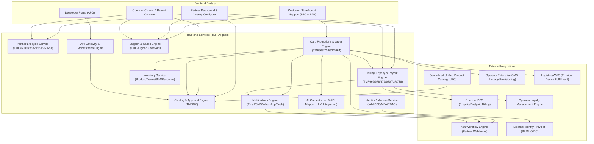

# B2B/B2C Telecom Marketplace — EPICs & User Stories

> **Version**: 1.32 · **Date**: August 2026
> **Components**: Partner Onboarding (PMP) · Catalog Management (CAT) · Order & Subscription (ORD) · Billing & Settlement (BIL) · AI & n8n (AI) · Support & Cases (SUP) · Platform Governance (ADM) · Inventory (INV) · Identity (IAM) · API Gateway (APG) · Notifications (NTF)

> **v1.17 change**: added warehouse configuration and shipment provenance; a managed channel master replacing the hard-coded dunning channel list; collections ownership between marketplace and seller, with category-based ladder profiles seeded at onboarding and the operator's view of seller drift; and credit/debit notes plus partner-approved customer refunds with the `AP-ADJ` API. 1,713 automated checks across eleven suites.
>
> **v1.18 change**: dunning ladders gained a scope, so a default can be published per marketplace category and per product category and the narrowest match wins; the seller's Reviews stub became a real screen reading real records; and ad banners gained drawn vector artwork in place of a printed filename. 1,759 automated checks across twelve suites.
>
> **v1.19 change**: persona scope tightened — the consumer console lost administrator panels and merged its two message screens, the enterprise buyer lost document formatting but kept role-addressed rules, the carrier cost column came off every persona but the operator, Send a test became a real delivery, and the basket gained Save for later. 1,800 automated checks across thirteen suites.
>
> **v1.20 change**: closed the four gaps from the cross-persona audit — arrears visible to the party being chased, a reviewer's own reviews with rewrite and challenge, buyer integration APIs bound by the buyer's own approval threshold, and seller guidance for refunds, notes and collections. 1,852 automated checks across fourteen suites.
>
> **v1.21 change**: the operator moderation queue rebuilt as one bordered card per decision; the chart of accounts made extendable with range, duplicate and description guards; and an English/Kiswahili switch added to all four personas with ~1,030 hand-written Kenyan Kiswahili phrases, English fallback and honest coverage reporting. 1,933 automated checks across fifteen suites.
>
> **v1.22 change**: French, Spanish and Arabic added alongside Kiswahili, with full right-to-left support for Arabic; banner prose routed through the translator so the explanation under a heading is translated, not just the heading. 2,022 automated checks across sixteen suites.
>
> **v1.23 change**: French, Spanish and Arabic brought to parity with Swahili at ~1,290 phrases each; inline button labels reached by a guarded post-render DOM pass; Arabic bidi fixed so untranslated English reads correctly in an RTL page; language switch collapsed to one compact control. 2,006 automated checks across seventeen suites.
>
> **v1.24 change**: fixed the language control — real icons instead of a fallback dot, mousedown-based dismissal so a chosen language can be changed again, Escape to close, and a search placeholder translated as one phrase. Regression now drives the control with real mouse events. 2,042 automated checks across seventeen suites.
>>
> **v1.25 change**: the multi-language layer was withdrawn at the request of the product owner and the build returned to English only. Every translation file, token wrapper, language control and RTL rule removed and verified absent. 1,910 automated checks across sixteen suites.
>
> **v1.26 change**: order stages became real records rather than decoration; a full loyalty and rewards programme added across all four personas with a funded-points liability model, a ledger and GL postings; refund escalation moved from a customer button to an SLA clock; a dark theme added to the three customer-side portals with WCAG-verified tokens; and the enterprise approval threshold gained its currency. Four audit actions writing to an unreadable category were corrected. 2,084 automated checks across eighteen suites.
>
> **v1.27 change**: the reward redemption catalogue and the tier ladder became operator-editable, and every live redemption was constrained to settle inside the marketplace. 2,128 automated checks across eighteen suites.
>
> **v1.28 change**: onboarding tasks scoped to a partner and driven by that partner's gates; operator-led onboarding rebuilt as a stepped capture with real settlement fields and file attachment; settlement detail masked everywhere with an audited reveal; sellers and buyers can each see and correct what we hold about them; drawn product artwork replaced the category glyphs; consumer alert channels made selectable. 2,275 automated checks across nineteen suites.
>
> **v1.32 change**: the developer portal rebuilt against how public portals actually work. Every published API version carries a generated OpenAPI 3.1 document and endpoint records with scopes and worked examples; applications become the subscribable object; credentials are issued per environment, returned once, stored hashed, rotatable with a grace window and revocable with a reason; sandbox calls execute against seeded data; deprecation with a sunset date and a migration note replaces deletion. Two new EPICs, 14 stories.

> **v1.31 change**: Notify me is a real control on an out-of-stock product on both buy sides, creating an audited watch record with a channel on it, plus a Waiting for stock list; the enterprise catalogue stopped offering Add to requisition on what it cannot supply.

> **v1.30 change**: product eligibility and dependency — twenty products carry requires / excludes / works-with rules with a stated reason, enforced at the basket for both buy sides and governed in an operator register; a plan change is modelled as a declared switch rather than refused as a duplicate; the bundle builder now obeys the same rules at the point of choice; partner Documents given the full width; the settlement invoice action unified across the run and the register. 2,578 automated checks across twenty-one suites.

> **v1.29 change**: action columns hold their shape platform-wide with an audit that detects the defect; fulfilment routing and the reward catalogue became configuration; wallets modelled as stored value with a two-pot liability and an operator view; operator roles extended from six to thirteen with a thirty-two row matrix; media gained view and download; the tax preview stopped printing the same figure twice; the bill sketch follows its sections; out-of-stock tiles recede. 2,449 automated checks across twenty-one suites.

> **v1.25 change**: multi-language withdrawn at the client's request. All five language dictionaries, the translation engine, RTL support, the DOM pass and the language switch removed; every wrapper unwound. The build is English-only again. 1,910 automated checks across sixteen suites.
>
> **v1.15 change**: added a per-persona knowledge base with guided walkthroughs across all four portals — EPIC SUP-BE-003 and SUP-FE-003, 9 stories. 1,347 automated checks across nine suites.
>
> **v1.14 change**: closed two controls that were shown but not real — the listing rules were displayed per category with no page to author them, and the per-seller listing cap was stored but never checked. Added EPIC CAT-BE-006 / CAT-FE-008 (rule catalogue) and CAT-BE-007 (listing cap), 12 stories. 1,285 automated checks across nine suites.
>
> **v1.13 change**: closed the last three gaps and added bulk update — authentication, sessions and enforced SSO (IAM), Number Management / Logical Inventory integration for ICCID, IMSI and MSISDN (INV), channel delivery with receipts and retry (NTF), and bulk update across all four personas (ADM). 8 new EPICs, 34 stories, all marked **[P]**. 1,247 automated checks across nine suites. **No front-end gap remains.** No existing story was removed or renumbered.
>
> **v1.12 change**: closed the last five build gaps and added forecasting — the marketplace developer portal (APG), listing versioning, contract pricing and product comparison (CAT), warehouse system integration (INV), hash-chained audit storage with SIEM export (ADM) and dunning (ORD), plus per-persona revenue and spend projection. 9 new EPICs, 36 stories, all marked **[P]**. 1,091 automated checks across eight suites. No existing story was removed or renumbered.
>
> **v1.11 change**: closed six of the gaps recorded in v1.10 — the audit trail (ADM), storefront advertising (ORD), inventory (INV), full ticketing and SLA (SUP), customer review submission (CAT) and the partner branding customiser (PMP). Coverage table below updated; those stories now carry **[P]**. 1,006 automated checks across seven suites.
>
> **v1.10 change**: aligned to the working prototype. Added 11 new EPICs and 58 stories covering three-tier pricing and the cost floor, the conditional discount engine, tax and merchant of record, commercial models, partner billing cycles, onboarding gate policy, partner outbound integrations, the multi-media listing manager, the roles matrix, credential security, per-channel notification content, reporting periods and export. Added a [Prototype Implementation Status](#prototype-implementation-status) section with traceability to the built screens and the automated checks that cover them. No existing story was removed or renumbered.

---

## Table of Contents

- [Component Map](#component-map)
- [EPIC Numbering Convention](#epic-numbering-convention)
- [Prototype Implementation Status](#prototype-implementation-status)
- [Component 1 — Partner Management & Onboarding (PMP)](#component-1--partner-management--onboarding-pmp)
- [Component 2 — Catalog & Bundling Engine (CAT)](#component-2--catalog--bundling-engine-cat)
- [Component 3 — Order, Shopping Cart, & Subscription Engine (ORD)](#component-3--order-shopping-cart--subscription-engine-ord)
- [Component 4 — Billing, Settlement, & Loyalty Integration (BIL)](#component-4--billing-settlement--loyalty-integration-bil)
- [Component 5 — AI & n8n Integration (AI)](#component-5--ai--n8n-integration-ai)
- [Component 6 — Support & Case Management (SUP)](#component-6--support--case-management-sup)
- [Component 7 — Admin Governance & Infrastructure (ADM)](#component-7--admin-governance--infrastructure-adm)
- [Component 8 — Inventory Management (INV)](#component-8--inventory-management-inv)
- [Component 9 — Identity & Access Management (IAM)](#component-9--identity--access-management-iam)
- [Component 10 — API Gateway & Developer Portal (APG)](#component-10--api-gateway--developer-portal-apg)
- [Component 11 — Notifications Engine (NTF)](#component-11--notifications-engine-ntf)
- [Appendix D — v1.12 Story Index](#appendix-d--v112-story-index)
- [Appendix E — v1.13 Story Index](#appendix-e--v113-story-index)

---

## Component Map



---

## EPIC Numbering Convention

| Prefix | Component |
|--------|-----------|
| `PMP`  | Partner Management & Onboarding |
| `CAT`  | Catalog & Bundling Engine |
| `ORD`  | Order, Cart & Subscription Engine |
| `BIL`  | Billing, Settlement & Loyalty |
| `AI`   | AI & n8n Integration |
| `SUP`  | Support & Case Management |
| `ADM`  | Admin Governance & Infrastructure |
| `INV`  | Inventory Management |
| `IAM`  | Identity & Access Management |
| `APG`  | API Gateway & Developer Portal |
| `NTF`  | Notifications Engine |

Format: `{Component}-{FE/BE}-{Sequence}` → e.g., `ORD-BE-001`

### Status Legend (added v1.10)

| Marker | Meaning |
|---|---|
| **[P]** | **Demonstrated in the prototype** — a working screen exists and an automated check drives it to its conclusion and asserts the record changed |
| **[P-partial]** | Partly demonstrated; the caveat is stated on the story |
| *(unmarked)* | Specified, not yet built |

---

## Prototype Implementation Status

A working front-end prototype sits alongside these documents: `consumer.html` (16 screens), `partner.html` (22), `operator.html` (28), `enterprise.html` (19), entry point `index.html`. Four portals over one deterministic synthetic dataset, no back end.

### Component coverage

| Component | Status | Built | Not built |
|---|---|---|---|
| **PMP** | Demonstrated | 7-gate funnel, gate policy editor, per-gate submissions, second-category application with KYC carry-over, partner invitation, vetting board, **branding customiser with contrast gating** | — |
| **CAT** | Demonstrated | Listing wizard, multi-media manager, three-tier pricing, per-category policy, **rule catalogue with a rule × category matrix and enforced per-seller listing cap**, review queue with seller queries, operator first-party bundling, customer review submission and moderation, **listing version history with rollback, account contract pricing, three-way product comparison** | UPC federation (modelled locally) |
| **ORD** | Demonstrated | Cart, checkout, 5 fulfilment pipelines, enterprise requisition and approval policy, subscription lifecycle, seat assignment, order intervention, storefront advertising across four slots, **seven-step dunning ladder with promise-to-pay** | — |
| **BIL** | Demonstrated | Self-billing invoice, settlement approval, bill formatting, per-partner cycles, commercial models, tax and MoR, discount engine | Loyalty programme/tier definition (TMF737), BSS charge posting |
| **AI** | Partial | AARYA assistant with confidence levels and declared sources | n8n orchestration, NL-to-workflow, usage harvesting |
| **SUP** | Demonstrated | **Per-persona knowledge base with walkthroughs that drive the console**, disputes, plus the **full ticketing lifecycle — categories, priorities, SLA clocks that pause when waiting on the requester, automatic escalation, threaded replies and internal notes** | Channel integration |
| **ADM** | Demonstrated | Roles matrix in all four portals, users directory, credential security, notification rules and message content, export, reporting periods, append-only audit trail with per-role scoping and redaction, **hash chain with on-demand verification, SIEM streaming, per-persona projection with measured backtest error, bulk update with mandatory dry run and per-row rejection** | — |
| **INV** | Demonstrated | Stock ledger with reservations, movement history, oversell prevention, SIM pool lifecycle, capacity pools, WMS links with drift detection, **Number Management integration — ICCID, IMSI and MSISDN federated from the BSS via TMF639/TMF652, SGP.22 profile lifecycle, nightly reconciliation where the BSS always wins** | — |
| **IAM** | Demonstrated | **Real sign-in gate — credentials, TOTP, passkey, per-account lockout, enforced SSO closing the local password path, step-up before sensitive actions, session listing and revocation, sign-in history including failures** | A server to check credentials against |
| **APG** | Demonstrated | **Outbound**: seven APIs, each version carrying a generated OpenAPI 3.1 document and endpoint records with scopes and worked examples; applications with per-environment credentials issued once and stored hashed, rotation with a grace window, revocation with a reason; sandbox calls executed against seeded data; deprecation with sunset date and migration note. **Inbound**: registry of every partner's endpoints, 23 marketplace events, coverage matrix, callback policy, test calls, call log. Integration is a **tested gate** that blocks go-live | A real gateway terminating the calls; token exchange at an authorisation server |
| **NTF** | Demonstrated | Rule builder, role-addressed rules, per-channel templates, token preview, SMS segment counting, **transport layer — providers with protocol and cost, primary and failover, full DLR state machine, retry with backoff, hard-rejection rules, per-message reason codes, channel spend** | A carrier to actually hand a message to |

### Verification

**1,604 automated checks** across ten suites. They do not assert that a screen rendered — they drive each journey to its conclusion and assert the underlying record changed, clicking through confirmation dialogs as a person would.

```bash
npm install jsdom
node _src/journeys.js             # 116 — core buying, selling and safeguard journeys
node _src/journeys_admin.js       # 155 — administration and presentation contract
node _src/journeys_config.js      # 204 — roles, passwords, export, profile, billing, tax
node _src/journeys_catalogue.js   # 246 — notifications, onboarding, catalogue, rule catalogue, listing cap, plans, reporting
node _src/journeys_commerce.js    # 112 — media, integrations, pricing, discount engine
node _src/journeys_audit.js       # 133 — audit trail and storefront advertising
node _src/journeys_ops.js         # 140 — inventory, ticketing, reviews, branding, knowledge base
node _src/journeys_platform.js    # 136 — developer portal, projection, dunning, WMS, versions, documents
node _src/journeys_final.js       # 156 — authentication, numbering, channel delivery, bulk update
node _src/smoke.js partner.html   # render walk across every screen
```

---

## Component 1 — Partner Management & Onboarding (PMP)

> [!IMPORTANT]
> All partner data models, legal documents, and role assignments must conform strictly to TMF Open APIs: TMF760 (Partner Management), TMF668 (Partnership Management), TMF632 (Party Management), TMF669 (Party Role), TMF667 (Document), and TMF651 (Agreement).

### EPIC PMP-BE-001: TMF-Aligned Partner Lifecycle (Backend)
**Description**: Core partner profile registrations, legal document uploads, revenue split templates, and status management.

| Story ID | Story Title | User Story | Acceptance Criteria | Priority | SP |
|----------|-------------|------------|---------------------|----------|----|
| PMP-BE-001-01 | TMF760 Partner Onboarding API | As an **admin**, I want to register a partner company via a TMF760-compliant API so that company details are stored systematically. | ✅ Supports TMF760 payload (legal entity info, registration numbers) <br> ✅ Automatically generates unique Partner UUID <br> ✅ Validates mandatory contact records | P0 | 5 |
| PMP-BE-001-02 | TMF632/669 Party & Role Creation | As the **onboarding engine**, I need to create Party and Party Role entries when a partner finishes registration. | ✅ Links partner to TMF632 Party resource <br> ✅ Assigns appropriate TMF669 role (e.g., `Partner_Admin`, `Partner_Developer`) <br> ✅ Exposes role querying endpoints | P0 | 5 |
| PMP-BE-001-03 | TMF667 Document KYB Upload | As a **partner user**, I want to upload business license and tax certificates via a TMF667-compliant API. | ✅ API accepts document attachments with metadata <br> ✅ Links uploaded files to the Partner ID <br> ✅ Validates file types (PDF, PNG, JPG) and restricts sizes | P0 | 5 |
| PMP-BE-001-04 | TMF651 Settlement Agreement Config | As an **operator admin**, I want to define the partner revenue share terms via a TMF651-compliant agreement API. | ✅ CRUD for agreement terms and revenue splits (e.g. 80/20) <br> ✅ Versioning support for agreements <br> ✅ Associates multiple agreement documents (TMF667) | P1 | 8 |
| PMP-BE-001-05 | Partner Vetting & Activation Flow | As an **operator admin**, I want to approve or suspend a partner entity so that their products are activated or deactivated in the catalog. | ✅ Restricts product visibility for unapproved partners <br> ✅ Triggers webhook event on partner state change <br> ✅ Fully audited status history transitions | P0 | 3 |
| PMP-BE-001-06 | TMF668 Partnership Agreement & Type API | As an **admin**, I want to configure partnership types and relations via a TMF668-compliant API. | ✅ Define partnership types (e.g., Reseller, Co-Seller, Referral) <br> ✅ Records partnership agreement records (TMF668) <br> ✅ Query active partnerships per partner profile | P1 | 5 |

### EPIC PMP-FE-001: Partner Onboarding, Branding & User Admin (Frontend)
**Description**: Build guided forms, branding customizations, user management tables, and dashboard consoles for Sellers.

| Story ID | Story Title | User Story | Acceptance Criteria | Priority | SP |
|----------|-------------|------------|---------------------|----------|----|
| PMP-FE-001-01 | Step-by-Step Partner Sign-Up | As a **partner manager**, I want a guided onboarding wizard to input company data and upload verification files. | ✅ Multi-step wizard UI <br> ✅ File upload drag-and-drop widget for KYB certificates <br> ✅ Interactive Bank details configuration form <br> ✅ In-progress form state cached locally | P0 | 8 |
| PMP-FE-001-02 | Operator Partner Vetting Board | As an **operator admin**, I want a centralized screen to view pending partners, audit KYB files, and click approve. | ✅ Lists all partners awaiting vetting <br> ✅ Document viewer component to review certificates directly in-app <br> ✅ One-click Approve / Reject action with notes input | P0 | 8 |
| PMP-FE-001-03 | Partner Brand & Theme Customizer | As a **partner admin**, I want to customize our portal colors, dark/light theme, and upload brand logos. | ✅ Upload logo image file with size validator <br> ✅ Primary and secondary color palette picker widgets <br> ✅ Dark mode vs light mode toggle widget <br> ✅ Custom check-boxes to enable/disable specific dashboard widgets/cards | P1 | 8 |
| PMP-FE-001-04 | Partner User & Role Manager | As a **partner manager**, I want to invite employees and assign them platform roles. | ✅ Invite modal sending email links <br> ✅ User management list displaying names, status, and roles <br> ✅ TMF669-compliant dropdown selectors (Admin, Developer, Finance) | P1 | 5 |
| PMP-FE-001-05 | Corporate Customer User & Role UI | As a **B2B corporate IT admin**, I want to add employee users and assign them spending limits and permissions. | ✅ Employee users CRUD grid <br> ✅ Assign role permissions (Purchaser, Approver, Viewer) <br> ✅ Input fields to cap maximum monthly purchase limits per user | P1 | 8 |

### EPIC PMP-BE-002: Onboarding Gate Policy & Submission Record (Backend) — *added v1.10*
**Description**: Turn partner onboarding from a status field into seven governed, sequential gates, each with an owner, a target, an evidence list and an auditable submission.

| Story ID | Story Title | User Story | Acceptance Criteria | Priority | SP |
|----------|-------------|------------|---------------------|----------|----|
| PMP-BE-002-01 | Seven-Gate Onboarding State Machine **[P]** | As the **onboarding engine**, I want partner applications to progress through seven sequential gates so that no application reaches production before due diligence clears. | ✅ Gates: Application ➔ KYC ➔ Agreements ➔ Bank & tax ➔ Technical readiness ➔ Compliance review ➔ Go-live <br> ✅ Gates are strictly sequential; a later gate cannot open while an earlier one is open <br> ✅ Clearing a gate opens exactly the next gate that is not already cleared <br> ✅ Gate state transitions are audited with actor and timestamp | P0 | 8 |
| PMP-BE-002-02 | Gate Policy Configuration API **[P]** | As an **operator admin**, I want each gate's owner, target days, dual-control flag and waivability to be configurable. | ✅ CRUD for gate policy: owner, SLA in working days, dualControl, waivable, evidence list <br> ✅ **KYC and Agreements are hard-coded non-waivable** and the API rejects any attempt to set `waivable=true` on them <br> ✅ Changes apply only to applications that have not yet reached the gate <br> ✅ Total target across gates is recomputed and returned | P0 | 5 |
| PMP-BE-002-03 | Gate Submission Record **[P]** | As an **auditor**, I want every gate to store what was actually submitted at it, not just that it passed. | ✅ Per gate per partner: field values declared, documents attached, submittedBy, submittedOn, reviewedBy, reviewedOn, decision, note <br> ✅ A gate not yet reached returns no submission rather than an empty one <br> ✅ Evidence checklist is evaluated against the submission and returns per-item satisfied/outstanding | P0 | 8 |
| PMP-BE-002-04 | Existing-Partner Category Extension **[P]** | As an **existing partner**, I want to apply for an additional marketplace category without repeating due diligence. | ✅ KYC and settlement account are carried over and marked `carried`, with a rescreen date rather than a resubmission <br> ✅ Application opens at the agreements gate <br> ✅ Only one category application may be in flight per partner at a time <br> ✅ Carried gates are distinguishable from freshly submitted gates in the API response | P1 | 8 |

### EPIC PMP-FE-002: Onboarding Transparency for Partner & Operator (Frontend) — *added v1.10*
**Description**: Make the funnel readable from both sides — the operator sees where time is going, the partner sees exactly what is being asked of them.

| Story ID | Story Title | User Story | Acceptance Criteria | Priority | SP |
|----------|-------------|------------|---------------------|----------|----|
| PMP-FE-002-01 | Clickable Gate Pipeline **[P]** | As an **operator agent**, I want to click any gate in a partner's pipeline and read what was submitted at it. | ✅ Each of the seven gates is an actionable control, not decoration <br> ✅ Opens the submitted fields, documents, submitter, reviewer and decision <br> ✅ Evidence checklist shows each item ticked or explicitly outstanding <br> ✅ Screen-reader label states the gate number, name, state and whether anything was submitted <br> ✅ Step controls move to the previous and next gate | P0 | 8 |
| PMP-FE-002-02 | Gate Policy Editor UI **[P]** | As an **operator admin**, I want to change gate owners, targets and dual control from one screen. | ✅ Table of all seven gates with owner dropdown, target-days input, dual-control and waivable toggles <br> ✅ Waivable toggles for KYC and Agreements are **disabled**, with the reason stated on screen <br> ✅ Saving reports how many gates changed and the new total target <br> ✅ States that changes apply only to applications not yet at the gate | P0 | 5 |
| PMP-FE-002-03 | Onboarding Guide for the Partner **[P]** | As a **partner**, I want a guide that tells me what each gate wants and how long it should take. | ✅ Every gate listed with owner, target, dual-control requirement and evidence list <br> ✅ The partner's current gate is marked <br> ✅ States plainly which gates cannot be waived and why <br> ✅ Routes directly into the open gate | P1 | 5 |
| PMP-FE-002-04 | Partner's Own Submission View **[P]** | As a **partner**, I want to see exactly what I submitted at each gate of my application. | ✅ Shows declared fields, documents, submission and review dates <br> ✅ Carried-over gates are labelled and explain that an existing partner does not repeat due diligence <br> ✅ The open gate shows the blocking task and the actual failure detail <br> ✅ A gate not yet open says so rather than presenting an empty form | P1 | 8 |
| PMP-FE-002-05 | Personal-Data Document Viewer **[P]** | As a **reviewer**, I want to open an onboarding document without the platform treating it as an ordinary file. | ✅ Viewer states that contents are not reproduced and why <br> ✅ Notes that in production the view is access-logged, watermarked with the viewer's identity and not bulk-downloadable <br> ✅ Download is a distinct, logged action | P1 | 3 |

---

## Component 2 — Catalog & Bundling Engine (CAT)

> [!IMPORTANT]
> The catalog system governs six marketplace segments: **Consumer** (mobile plans, handsets, OTT, insurance), **Partner** (B2B2X apps & services), **IoT** (SIMs, sensors, device bundles), **Security** (Firewall, MDR, VPN), **Device** (phones, routers, CPE), and **Digital Content** (OTT, gaming, music). Each segment has specific catalog attributes, fulfillment models (digital activation, SIM provisioning via OMS, or physical logistics/WMS shipment), and listing templates. The catalog also governs media (images, datasheets, manuals), customer feedback reviews, UPC federation, and min/max pricing boundaries.

### EPIC CAT-BE-001: TMF620 Catalog, Media, Manuals & Reviews (Backend)
**Description**: Catalog database models, manual uploads, customer reviews pipelines, and UPC integrations.

| Story ID | Story Title | User Story | Acceptance Criteria | Priority | SP |
|----------|-------------|------------|---------------------|----------|----|
| CAT-BE-001-01 | TMF620 Catalog Management API | As a **partner manager**, I want to upload, view, and modify product listings via a TMF620-compliant API, with the product classified under one of the six marketplace segments. | ✅ Schema supports TMF620 specification <br> ✅ Mandatory `segment` field (enum: Consumer, Partner, IoT, Security, Device, DigitalContent) on each ProductOffering <br> ✅ Handles categories, descriptions, images, tags, and dependencies <br> ✅ Restricts editing of products currently in `PENDING_APPROVAL` | P0 | 8 |
| CAT-BE-001-02 | TMF620 Price Plan Configurator | As a **partner developer**, I want to configure recurring, usage-based, and seat-based pricing schemas for my products. | ✅ Support flat rate monthly, usage-based tiered rate, and seat price schemas <br> ✅ Configures billing frequency parameters <br> ✅ Validation schema ensuring no empty prices are published | P0 | 8 |
| CAT-BE-001-03 | Joint Telecom & Partner Bundling Engine | As an **operator admin**, I want to configure bundles containing operator connectivity and partner software. | ✅ Bundle constructor linking TMF620 items <br> ✅ Calculates discount percentage adjustments <br> ✅ Specifies internal billing codes for separate telecom BSS ledger entries | P0 | 13 |
| CAT-BE-001-04 | Partner API Provisioning Webhook Settings | As a **partner developer**, I want to register our service endpoints to receive order activation alerts. | ✅ Configuration page for webhook endpoints (CREATE, TERMINATE, SUSPEND) <br> ✅ Generates cryptographic secrets to sign outgoing payloads | P1 | 5 |
| CAT-BE-001-05 | Listing & Price Change Approval Workflow API | As an **operator admin**, I want an API to govern the approval states of products and pricing plans. | ✅ States: `Draft` ➔ `Pending_Approval` ➔ `Active` or `Rejected` <br> ✅ Prevent modifications to active listings without triggering a new version in `Pending_Approval` <br> ✅ Audit log captures differences in descriptions, media, and prices before/after approvals | P0 | 8 |
| CAT-BE-001-06 | Product Catalog Federation & UPC Sync Engine | As the **marketplace system**, I want to federate and synchronize product catalogs with the Centralized UPC. | ✅ Scheduled pull synchronization querying Centralized UPC TMF620 endpoints <br> ✅ Event listener interface handling real-time push events from the UPC <br> ✅ Auto-map UPC product schemas and categories into local marketplace data models | P0 | 13 |
| CAT-BE-001-07 | Min/Max Price Limits Engine | As a **partner user**, I want to define the minimum and maximum sellable price for our plans so that pricing ranges are restricted. | ✅ Add `minPrice` and `maxPrice` attributes to the TMF620 pricing model schema <br> ✅ Expose pricing boundary check API used by order checkout and negotiation engines <br> ✅ Validate that maxPrice is greater than or equal to minPrice | P0 | 5 |
| CAT-BE-001-08 | Customer Ratings & Review API | As a **customer**, I want to submit a 1-5 star rating and review comments for a product I purchased. | ✅ REST API for review submission <br> ✅ Validates that the customer has an active or past order for the target product ID <br> ✅ Calculates average ratings per product dynamically | P1 | 5 |
| CAT-BE-001-09 | Product Manual & Datasheet Upload API | As a **partner user**, I want to attach datasheets and user manuals to my product catalog details. | ✅ Uploads file attachments (PDF, DOCX) via TMF667 Document API <br> ✅ Associates files with specific Product Catalog IDs <br> ✅ Secures file downloads, validating customer order status prior to sending file bytes | P1 | 8 |
| CAT-BE-001-10 | IoT & Device Segment Extended Attributes API | As a **partner selling IoT or Device products**, I want to attach segment-specific extended attributes to my product listings so buyers see relevant technical specifications. | ✅ IoT products support extra fields: SIM type (eSIM/physical), network band (LTE/5G/NB-IoT), data bundle size, supported sensor protocol (MQTT/CoAP), bulk order quantity <br> ✅ Device products support: SKU/model, storage/RAM/color variants, stock level (In Stock / Low Stock / Out of Stock), locked/unlocked flag, estimated delivery days <br> ✅ Extended attribute schema is validated before `Pending_Approval` submission <br> ✅ Attributes are returned via TMF620 product detail API response | P1 | 8 |
| CAT-BE-001-11 | Product Catalog Versioning API | As a **partner or operator**, I want every published product and price change to create a new immutable version so that rollback and audit are possible. | ✅ Each `ProductOffering` and `PriceSpec` change increments a version counter and archives the previous version <br> ✅ GET `/productOffering/{id}/versions` endpoint returns full version history <br> ✅ Rollback endpoint to restore a previous version to `Active` state <br> ✅ Version diff view shows field-level changes between any two versions | P1 | 8 |
| CAT-BE-001-12 | Contract Pricing API | As a **partner or operator**, I want to configure contract-based pricing tiers available only to a specific B2B account or account group, separate from standard list prices. | ✅ Contract price records link a `PriceSpec` to a specific `AccountId` or `AccountGroup` (TMF666) <br> ✅ Cart engine checks for contract prices before falling back to list price <br> ✅ Contract prices respect min/max guardrails defined by the partner <br> ✅ CRUD endpoints for contract price records with expiry dates | P1 | 8 |

### EPIC CAT-FE-001: Storefront Search, Ratings & Product Manual Downloader (Frontend)
**Description**: Customer shopping catalog dashboard, filters, customer reviews feed, and purchased data sheet download options.

| Story ID | Story Title | User Story | Acceptance Criteria | Priority | SP |
|----------|-------------|------------|---------------------|----------|----|
| CAT-FE-001-01 | Catalog Segment Landing & Product Grid | As a **customer**, I want to browse the marketplace through clearly labelled segment pages (Consumer, IoT, Security, Device, Digital Content) and within each segment filter products by category, pricing model, and provider. | ✅ Storefront home shows six named segment cards with visual identity <br> ✅ Each segment landing page has its own product grid, hero banner, and segment-specific filter facets <br> ✅ Global search spans all segments with a segment badge on each result <br> ✅ Full-text search with keyword highlighting | P0 | 13 |
| CAT-FE-001-02 | Product Detail & Configurator UI | As a **customer**, I want to view description, choose plan tiers, select seat counts, and click add-to-cart. | ✅ Displays detailed product reviews and features <br> ✅ Live seat/user cost calculator widget <br> ✅ Standard button linking to Shopping Cart | P0 | 8 |
| CAT-FE-001-03 | Customer Ratings & Feedback Widget | As a **customer**, I want an interface on the product detail page to write a review and rate the product. | ✅ Star rating selector (1-5 clickable stars) <br> ✅ Text area for comments <br> ✅ Displays reviews history feed on the product detail tab | P1 | 5 |
| CAT-FE-001-04 | Product Datasheet & Manual Downloader | As a **purchasing customer**, I want to download product manuals and datasheets from my active subscription details dashboard. | ✅ Displays list of product manuals and technical datasheets if subscription is ACTIVE <br> ✅ Integrated click-to-download buttons fetching secure files <br> ✅ Restricts access if subscription is SUSPENDED or EXPIRED | P1 | 5 |
| CAT-FE-001-05 | Product Comparison Tool | As a **customer**, I want to select up to 3 products and view them side-by-side in a comparison table so I can make an informed purchase decision. | ✅ "Add to Compare" toggle on each product card (max 3 items) <br> ✅ Sticky comparison tray appears at bottom of screen with selected items <br> ✅ Comparison table renders feature/price/rating rows with highlight for best value <br> ✅ "Add to Cart" button per column in the comparison view | P1 | 8 |

### EPIC CAT-FE-002: Partner Product, Price, & Coupon Configurator UI (Frontend)
**Description**: Listing dashboards, pricing builders, coupon editors, and media upload wizards for App Providers.

| Story ID | Story Title | User Story | Acceptance Criteria | Priority | SP |
|----------|-------------|------------|---------------------|----------|----|
| CAT-FE-002-01 | Product Editor Wizard | As a **partner manager**, I want an editor to set product descriptions, categories, tags, and logo uploads. | ✅ Rich text description editor <br> ✅ Logo uploader with dimensions restriction checker <br> ✅ Input validation for TMF620 fields | P0 | 8 |
| CAT-FE-002-02 | Pricing Builder Interface | As a **partner commercial user**, I want an interface to construct subscription, user-based, and usage-based price plans. | ✅ Dynamic inputs for pricing parameters <br> ✅ "Submit for Approval" button triggering state transition to `Pending_Approval` <br> ✅ Displays historical status logs (Approved/Rejected with notes) | P0 | 8 |
| CAT-FE-002-03 | Price Limits Input Form | As a **partner commercial user**, I want input fields for minimum and maximum sellable prices in the pricing builder. | ✅ Numeric text fields for Min and Max price constraints <br> ✅ Form level check ensuring values match validator limits <br> ✅ Displays warning indicators if standard price falls outside these boundaries | P0 | 5 |
| CAT-FE-002-04 | Partner Coupon & Voucher Builder | As a **partner marketer**, I want to configure discount coupons and vouchers for our specific products. | ✅ Set voucher codes, discount types (percentage vs flat cash value), and limits <br> ✅ Link coupon specifically to one or more Partner Product IDs <br> ✅ Set active start and end dates | P1 | 8 |
| CAT-FE-002-05 | Catalog Assets & Document Uploader | As a **partner user**, I want uploader forms to attach product showcase images and user manuals to our product details. | ✅ Drag-and-drop file uploader for showcase product images <br> ✅ File selector widget to attach PDF product manuals and data sheets <br> ✅ Displays upload success/fail validations per file | P1 | 5 |

### EPIC CAT-FE-003: Operator Catalog Vetting, Approvals, & Bundle Promotions (Frontend)
**Description**: Review dashboards and bundle coupon consoles for Telecom Operator Administrators.

| Story ID | Story Title | User Story | Acceptance Criteria | Priority | SP |
|----------|-------------|------------|---------------------|----------|----|
| CAT-FE-003-01 | Catalog Review Dashboard | As an **operator admin**, I want a dashboard listing all products and price plans pending review. | ✅ Displays queue of products sorted by submission date <br> ✅ Highlights differences (diff view) between currently active details and proposed changes <br> ✅ "Approve" button and "Reject" button (with modal to input reason) | P0 | 8 |
| CAT-FE-003-02 | Operator Bundle Coupon Console | As an **operator marketer**, I want to configure promotions specifically for joint operator-partner bundles. | ✅ Coupon creation form specifying bundle criteria <br> ✅ Configures split parameters defining what percentage of the discount is absorbed by the operator <br> ✅ Validates coupon applies only to selected Bundle IDs | P1 | 8 |

### EPIC CAT-BE-002: Three-Tier Pricing & the Cost-Price Floor (Backend) — *added v1.10*
**Description**: Cost, list and sale as three distinct prices, with an absolute floor that no discount mechanism anywhere in the platform may breach.

| Story ID | Story Title | User Story | Acceptance Criteria | Priority | SP |
|----------|-------------|------------|---------------------|----------|----|
| CAT-BE-002-01 | Cost / List / Sale Price Model **[P]** | As a **partner**, I want to record what an item costs me separately from what it lists at and what it sells for today. | ✅ `cost`, `list` and `sale` are distinct fields on the price spec <br> ✅ `cost` is never exposed on any buyer-facing API response <br> ✅ Publication is rejected where `cost >= sale` <br> ✅ Discount headroom (`sale − cost`) is computed and exposed to internal pricing consumers | P0 | 5 |
| CAT-BE-002-02 | Operator Discount Allowance **[P]** | As a **partner**, I want to control how much of my margin the marketplace may spend on a promotion. | ✅ Per listing: allowance of 0 / 25 / 50 / 100 percent of headroom <br> ✅ Pricing engine will not take a line below `sale − (headroom × allowance)` from partner-funded discount <br> ✅ Discount beyond the allowance is attributed to marketplace-funded spend, not to the partner <br> ✅ The resulting minimum price is returned so the UI can state it | P0 | 5 |
| CAT-BE-002-03 | Absolute Cost Floor Enforcement **[P]** | As the **platform**, I want the cost floor enforced in the pricing engine so that no rule author can write around it. | ✅ Every discount computation is clamped at line cost, then again at basket cost <br> ✅ Clamping is reported, not silent — the caller receives the requested amount, the given amount and the reason <br> ✅ Applies identically to promotions, bundle discounts and operator overrides <br> ✅ An override submitted below cost is **raised to cost on save**, not merely flagged | P0 | 8 |
| CAT-BE-002-04 | Margin Stack Calculation **[P]** | As a **partner**, I want to see what is actually left after everyone has taken their cut. | ✅ Returns sale, commission, payment and per-order fees, settled amount, cost, margin and margin percentage <br> ✅ Flags the case where commission and fees exceed margin, rather than showing a healthy settlement figure <br> ✅ Recomputes live as the price is typed | P1 | 5 |

### EPIC CAT-BE-003: Operator First-Party Composition (Backend) — *added v1.10*
**Description**: Let the operator compose its own marketplace listings from its existing BSS catalogue rather than retyping tariffs.

| Story ID | Story Title | User Story | Acceptance Criteria | Priority | SP |
|----------|-------------|------------|---------------------|----------|----|
| CAT-BE-003-01 | BSS Catalogue Component Source **[P-partial]** | As the **operator**, I want marketplace listings to pull components from my own product catalogue. | ✅ Component source exposes family, type, recurring charge, non-recurring charge, unit and specification <br> ✅ Component cost is carried alongside price so bundles can be floored <br> ✅ Component prices are snapshotted at composition; a later tariff change does not silently reprice a live listing <br> *Prototype note: modelled as a local catalogue of 17 products; UPC federation per CAT-BE-001-06 is not integrated* | P0 | 8 |
| CAT-BE-003-02 | Derived Bundle Pricing **[P]** | As an **operator merchandiser**, I want a bundle priced from its parts rather than typed. | ✅ Standing rule: configurable percentage off per extra component, capped <br> ✅ Per-component discount applies before the bundle rule <br> ✅ Each per-component discount is capped at that component's own cost <br> ✅ Blended margin and margin percentage returned <br> ✅ Bundle of fewer than the minimum component count is rejected — one product is a product, not a bundle | P0 | 8 |
| CAT-BE-003-03 | First-Party Listing Semantics **[P]** | As the **platform**, I want a first-party listing to behave differently from a partner listing. | ✅ No partner, zero commission, no settlement record <br> ✅ Does not enter the partner review queue — the operator is the reviewer <br> ✅ Goes live on creation <br> ✅ Component breakdown and saving-against-parts retained for display | P1 | 5 |

### EPIC CAT-FE-004: Multi-Media Listing Manager (Frontend) — *added v1.10*
**Description**: Replace the single-image placeholder with a real media manager. Extends CAT-FE-002-05.

| Story ID | Story Title | User Story | Acceptance Criteria | Priority | SP |
|----------|-------------|------------|---------------------|----------|----|
| CAT-FE-004-01 | Multiple Images with a Primary **[P]** | As a **partner**, I want several images on a listing and control over which one represents it. | ✅ 3 to 8 images; the first added becomes primary automatically <br> ✅ Any image can be made primary; exactly one is primary at all times <br> ✅ Removing the primary promotes the next image rather than leaving none <br> ✅ Primary image drives the product card and search result | P0 | 8 |
| CAT-FE-004-02 | Video and Document Attachments **[P]** | As a **partner**, I want to add a product video and a datasheet alongside the images. | ✅ At most one video per listing, with duration and size limits stated <br> ✅ Documents (PDF) attach as downloads <br> ✅ Media kinds are visually distinguishable in the manager and the gallery | P1 | 5 |
| CAT-FE-004-03 | Gallery Ordering **[P]** | As a **partner**, I want to control the order buyers see my media in. | ✅ Move-earlier and move-later controls per item, disabled at the ends <br> ✅ Order is persisted with the listing and is the gallery order <br> ✅ Controls are keyboard operable with accessible names | P1 | 3 |
| CAT-FE-004-04 | Mandatory Alt Text **[P]** | As a **buyer using a screen reader**, I want every image on a listing described. | ✅ Alt text field on every media item <br> ✅ Undescribed items are flagged inline with the reason <br> ✅ **The listing cannot be submitted while any item lacks alt text** <br> ✅ The submit path reports how many items are undescribed and returns the author to the media step | P0 | 5 |
| CAT-FE-004-05 | Media Completeness Gate **[P]** | As an **operator**, I want a listing to arrive at review with usable media or not at all. | ✅ Summary states image count, video and document counts, and what is missing <br> ✅ Submission blocked until minimum image count, primary image and full alt-text coverage are all satisfied <br> ✅ Media travels with the listing on submit rather than being discarded | P0 | 5 |

### EPIC CAT-FE-005: Category Definition & Listing Policy Console (Frontend) — *added v1.10*
**Description**: Make the marketplace segment list extensible and its catalogue rules configurable rather than hard-coded.

| Story ID | Story Title | User Story | Acceptance Criteria | Priority | SP |
|----------|-------------|------------|---------------------|----------|----|
| CAT-FE-005-01 | Define a Marketplace Category **[P]** | As an **operator admin**, I want to define a new marketplace category without a code change. | ✅ Name, audience, storefront copy, icon and a policy to copy from <br> ✅ Created **closed to buyers** by default <br> ✅ States that it has no partners and no listings rather than showing an encouraging zero <br> ✅ Existing partners must apply to it; being live in one category does not grant another <br> ✅ All category counts and copy are computed, so a seventh category does not make any wording wrong | P1 | 8 |
| CAT-FE-005-02 | Open and Close a Category **[P]** | As an **operator admin**, I want to withdraw a category from sale without deleting anything. | ✅ Closing requires typed confirmation <br> ✅ States how many live listings stop being sellable and that they are not deleted <br> ✅ States that recurring orders keep billing — closing a category does not cancel a contract <br> ✅ Reversible | P1 | 5 |
| CAT-FE-005-03 | Per-Category Policy Editor **[P]** | As an **operator admin**, I want each category to carry its own catalogue rules. | ✅ Ten rules, each set to **enforce** (blocks publication), **warn** (on the checklist, does not block) or **off** <br> ✅ Review mode, auto-publish, fulfilment window, returns window, price floor and minimum seller rating per category <br> ✅ Shows which listings the policy is currently holding <br> ✅ Turning a rule off is presented as a deliberate decision, not a default | P0 | 8 |
| CAT-FE-005-04 | Catalogue-Wide Listing Policy Grid **[P]** | As an **operator admin**, I want to see every rule against every category at once. | ✅ Matrix of rules × categories showing enforce/warn/off <br> ✅ Count of listings each rule is currently holding <br> ✅ Review settings summarised per category with a route into the per-category editor <br> ✅ Explains that a rule is not global — a content rule is irrelevant in IoT | P1 | 5 |
| CAT-FE-005-05 | Ask the Seller a Question **[P]** | As a **catalogue reviewer**, I want to query a listing rather than only approve or reject it. | ✅ Names the recipient before sending <br> ✅ Refuses a query with no actual ask in it <br> ✅ Records a real query against the listing with a working-day due date <br> ✅ Option to hold the listing so the delay is attributed to the seller, not the review desk <br> ✅ The open query is visible to the next reviewer | P1 | 5 |

---

### EPIC CAT-BE-005: Listing Versioning & Contract Pricing (Backend) — *added v1.12*
**Description**: A listing is not a row that gets overwritten. It is a sequence of published states, any of which a buyer may have transacted against, plus a set of account-specific prices that override list for named buyers only.

| Story ID | Story Title | User Story | Acceptance Criteria | Priority | SP |
|----------|-------------|------------|---------------------|----------|----|
| CAT-BE-005-01 | Version History per Listing **[P]** | As a **partner**, I want every published change to my listing kept, so a pricing dispute can be settled from the record. | ✅ Each publish writes a new version with author, timestamp, summary and the full price and terms snapshot <br> ✅ Exactly one version is active at any time <br> ✅ A listing that has never been changed still carries version 1 <br> ✅ No API path updates or deletes an existing version | P1 | 8 |
| CAT-BE-005-02 | Field-Level Change Set **[P]** | As an **operator**, I want to see what actually changed between two versions, not that something did. | ✅ Diff between consecutive versions reports field, previous value and new value <br> ✅ Price changes report the delta and its direction <br> ✅ Where nothing material changed, that is stated rather than showing an empty diff | P2 | 5 |
| CAT-BE-005-03 | Rollback as Forward Motion **[P]** | As a **partner**, I want to revert to an earlier price without erasing the fact that I moved away from it. | ✅ Rollback creates a **new** version carrying the earlier values <br> ✅ The intervening versions remain in the history and remain retrievable <br> ✅ The new version records which version it restored <br> ✅ The action is written to the audit trail | P1 | 5 |
| CAT-BE-005-04 | Account Contract Price **[P]** | As an **operator**, I want a negotiated price to apply to the account it was negotiated with and to nobody else. | ✅ Contract price binds account, SKU, price, minimum quantity, term start and term end <br> ✅ Resolution for any other account returns list <br> ✅ Below-cost contract prices are rejected at authoring against the CAT-BE-002-03 floor <br> ✅ An expired term stops resolving without deleting the record | P1 | 8 |
| CAT-BE-005-05 | Unsigned Prices Are Recorded, Not Applied **[P]** | As a **buyer**, I do not want to be charged a price nobody has signed. | ✅ A contract record in draft or pending state never participates in price resolution <br> ✅ It remains visible to the buyer with its status <br> ✅ The rule is stated on the buyer's screen, whether or not they currently have an unsigned record | P1 | 3 |

### EPIC CAT-FE-007: Product Comparison (Frontend) — *added v1.12*
**Description**: Side-by-side comparison that ends in a decision rather than a spreadsheet.

| Story ID | Story Title | User Story | Acceptance Criteria | Priority | SP |
|----------|-------------|------------|---------------------|----------|----|
| CAT-FE-007-01 | Compare Tray **[P]** | As a **buyer**, I want to collect candidates while I browse. | ✅ Compare toggle on every product card, reflecting selected state <br> ✅ Persistent tray shows current picks and allows removal <br> ✅ Selection survives filtering and category changes within the session | P2 | 5 |
| CAT-FE-007-02 | Three-Item Cap **[P]** | As a **buyer**, I want a comparison I can read without scrolling sideways. | ✅ Cap of three enforced; a fourth pick is refused with the reason stated <br> ✅ The cap is visible before it is hit, not only when it is | P2 | 3 |
| CAT-FE-007-03 | Comparison Table **[P]** | As a **buyer**, I want the differences that matter, not a specification dump. | ✅ Rows for price, rating, availability, fulfilment, seller and term <br> ✅ Availability reads from the stock ledger, not from a static field <br> ✅ Missing data is declared, never rendered as zero | P2 | 5 |
| CAT-FE-007-04 | Highlight Without Recommending **[P]** | As a **buyer**, I want to know the marketplace is not steering me. | ✅ Best value per row highlighted <br> ✅ Table states that the highlight is arithmetic on one dimension and not a recommendation <br> ✅ Every column can be added to the basket directly | P2 | 3 |

---
### EPIC CAT-BE-006: Listing Rule Catalogue (Backend) — *added v1.14*
**Description**: The rules themselves, not merely the level at which a category applies them.

| Story ID | Story Title | User Story | Acceptance Criteria | Priority | SP |
|----------|-------------|------------|---------------------|----------|----|
| CAT-BE-006-01 | Rule Definition **[P]** | As a **catalogue owner**, I want a rule to carry everything needed to run and defend it. | ✅ Name, requirement text, basis, owner, evidence, check type, blocking and appealable flags <br> ✅ Requirement text is written as a seller-facing instruction, and the editor says so <br> ✅ A rule without an owner is not saveable | P1 | 8 |
| CAT-BE-006-02 | Check Types and Their Cost **[P]** | As an **operations lead**, I want to know what a rule costs before I switch it on. | ✅ Automated, external, document and manual, each with stated reviewer minutes <br> ✅ Cost projected across the listings in the categories where it applies <br> ✅ A manual rule on a high-volume category is called out explicitly | P1 | 5 |
| CAT-BE-006-03 | Draft, Active, Retired **[P]** | As a **catalogue owner**, I want a safe path in and a safe path out. | ✅ A new rule is created as a draft and applies nowhere <br> ✅ Activation makes it available but still applies nowhere until placed in the matrix <br> ✅ **Retire, never delete** — past decisions cite it <br> ✅ Retirement removes it from every category and from new submissions <br> ✅ **Listings already rejected under it stay rejected** | P1 | 8 |
| CAT-BE-006-04 | Locked Rules **[P]** | As a **compliance officer**, I want rules that are not the marketplace's to soften. | ✅ Sanctions screening is fixed at enforce in every category <br> ✅ Attempts to change it are refused with the reason <br> ✅ The lock is visible, not silent | P0 | 3 |

### EPIC CAT-FE-008: Rule Matrix and Editor (Frontend) — *added v1.14*

| Story ID | Story Title | User Story | Acceptance Criteria | Priority | SP |
|----------|-------------|------------|---------------------|----------|----|
| CAT-FE-008-01 | Rule × Category Matrix **[P]** | As an **operator**, I want to answer "where does this apply" without opening six inspectors. | ✅ Every live rule against every category in one grid <br> ✅ Each cell cycles off, warn, enforce <br> ✅ Locked cells are shown as locked and refuse the change <br> ✅ Every change is audited | P1 | 8 |
| CAT-FE-008-02 | Rule Catalogue Table **[P]** | As a **catalogue owner**, I want the whole rulebook on one screen. | ✅ Rule, check type, basis, owner, evidence, categories applied in, status <br> ✅ Filterable by status, searchable, exportable <br> ✅ Retired rules remain listed | P1 | 5 |
| CAT-FE-008-03 | Unapplied Rule Warning **[P]** | As an **operator**, I want to be told when a rule is decorative. | ✅ An active rule applied to no category is flagged <br> ✅ The message says it checks nothing while still looking like a control <br> ✅ No warning while every active rule is in use | P2 | 3 |
| CAT-FE-008-04 | Cost Shown Before Saving **[P]** | As an **operations lead**, I want the reviewer load in front of me at the decision. | ✅ Projected hours per catalogue pass shown in the editor <br> ✅ Escalated in tone for manual checks | P2 | 3 |

### EPIC CAT-BE-007: Per-Seller Listing Cap (Backend) — *added v1.14*
**Description**: A limit that was stored and never checked. A cap that is not enforced is a comment.

| Story ID | Story Title | User Story | Acceptance Criteria | Priority | SP |
|----------|-------------|------------|---------------------|----------|----|
| CAT-BE-007-01 | Cap Definition per Category **[P]** | As an **operator**, I want a different ceiling where vetting is heavier. | ✅ Cap set per category in the policy inspector <br> ✅ Label states it counts live listings, resolving the collision with "held" meaning blocked in review | P1 | 3 |
| CAT-BE-007-02 | What Counts Against It **[P]** | As a **seller**, I want the count to be fair. | ✅ Live and paused occupy a slot <br> ✅ Withdrawn and rejected do not, or a seller could never recover from a bad submission <br> ✅ The rule is stated on the screen | P1 | 3 |
| CAT-BE-007-03 | Enforced at Submission **[P]** | As the **platform**, I want the cap to be a control. | ✅ Submission is refused at the cap, naming the count and the limit <br> ✅ No listing record is created <br> ✅ Enforced on the bulk path identically <br> ✅ Raising the cap clears the breach immediately | P1 | 5 |
| CAT-BE-007-04 | Headroom Shown Early **[P]** | As a **seller**, I do not want to find out at the end. | ✅ Remaining slots shown when the category is chosen <br> ✅ Warning at five slots left, block at zero <br> ✅ The review step states which number this listing will be | P2 | 3 |

---

## Component 3 — Order, Shopping Cart, & Subscription Engine (ORD)

> [!IMPORTANT]
> The Shopping Cart (TMF663) is the **single, universal checkout path** for all customer segments — B2C consumers, B2B SMBs, and B2B Enterprises alike. CPQ/RFQ negotiation flows and complex enterprise networking products (SDWan, IPMPLS, etc.) are **out of scope**. Enterprise buyers may attach a PO number and link a corporate billing account, but no multi-step quoting cycle is required.

### EPIC ORD-BE-001: TMF-Compliant Cart, Promotions & Order Orchestrator (Backend)
**Description**: Real-time shopping cart states, coupon validations, pricing guardrail enforcements, order conversions, and n8n/OMS synchronization.

| Story ID | Story Title | User Story | Acceptance Criteria | Priority | SP |
|----------|-------------|------------|---------------------|----------|----|
| ORD-BE-001-01 | TMF663 Shopping Cart API | As a **customer**, I want to add, update, and delete items in a persistent shopping cart via a TMF663-compliant API. | ✅ Cart CRUD endpoints matching TMF663 <br> ✅ Checks product availability and plan compatibility <br> ✅ Applies dynamic cart pricing calculations | P0 | 8 |
| ORD-BE-001-02 | TMF622 Order Submission API | As a **customer**, I want to submit my shopping cart to generate a product order via a TMF622-compliant API. | ✅ Converts TMF663 cart to TMF622 order resource <br> ✅ Performs credit and inventory validation <br> ✅ Emits ORDER_PLACED events to downstream engines | P0 | 8 |
| ORD-BE-001-03 | n8n Provisioning Webhook Dispatcher | As the **orchestrator engine**, I need to call partner provisioning flows via external n8n instances upon successful payment. | ✅ Prepares n8n payload containing provisioning specs <br> ✅ Calls external n8n webhook API and monitors response <br> ✅ Receives asynchronous completion callback from n8n to active subscription | P0 | 8 |
| ORD-BE-001-04 | TMF664 Operator OMS Sync for Connectivity Add-ons | As the **orchestrator engine**, I need to route provisioning for operator-native connectivity add-ons (e.g. data packs, SIM activations) to the legacy OMS. | ✅ Identifies operator connectivity SKUs in order items <br> ✅ Dispatches TMF664 Resource Order to legacy OMS endpoint <br> ✅ Receives activation callback from OMS and updates order line item state <br> ✅ Does NOT apply to third-party partner digital services (provisioned via n8n) | P1 | 8 |
| ORD-BE-001-08 | Segment-Aware Order Routing Engine | As the **order management engine**, I need to inspect each order line item's marketplace segment and route its fulfillment to the correct downstream system without manual intervention. | ✅ **Digital / Security / Digital Content**: Dispatch n8n provisioning webhook and receive activation callback <br> ✅ **IoT SIMs & Connectivity (IoT Marketplace)**: Dispatch TMF664 Resource Order to Operator OMS for SIM activation; handle bulk SIM provisioning for enterprise orders <br> ✅ **Physical Devices (Device / Consumer / IoT sensor bundles)**: Call Logistics/WMS API with delivery address, SKU, and quantity; receive shipment tracking reference and surface to customer <br> ✅ Mixed-segment cart (e.g. Security subscription + router device) generates parallel fulfillment tracks per line item <br> ✅ All fulfillment state changes emit order status events (TMF622) visible on the customer order tracker | P0 | 13 |
| ORD-BE-001-05 | Subscription Lifecycle Manager (Suspend / Resume / Cancel) | As the **subscription controller**, I want dedicated state-transition APIs for each explicit lifecycle action so that customer self-service and back-office automation can trigger them reliably. | ✅ `POST /subscription/{id}/suspend` — marks subscription Suspended, triggers n8n deactivation webhook <br> ✅ `POST /subscription/{id}/resume` — re-activates subscription, triggers n8n re-activation webhook, and re-bills prorated amount for remainder of cycle <br> ✅ `POST /subscription/{id}/cancel` — schedules end-of-period cancellation, blocks renewal job, triggers partner deprovisioning <br> ✅ Immediate cancel (admin override) available with refund calculation <br> ✅ All state changes emit TMF622 order amendment events | P0 | 13 |
| ORD-BE-001-06 | TMF736 Promotion & Coupon Application API | As a **customer**, I want to apply a coupon code to my cart to receive a price discount. | ✅ API validates code status (valid, expired, user limits) via TMF736 <br> ✅ Modifies cart item pricing dynamically with discount line items <br> ✅ Limits promotion eligibility by account type (B2B vs B2C) | P1 | 8 |
| ORD-BE-001-07 | TMF736 Partner-configured Coupon Validation | As the **cart engine**, I need to validate partner-configured coupons against specific products in the cart. | ✅ Verifies coupon is created by the matching partner <br> ✅ Validates discount applies only to the partner's designated Product IDs <br> ✅ Splits commission logic using standard price before applying coupon rate | P1 | 5 |
| ORD-BE-001-08 | TMF736 Operator Bundle Coupon Validation | As the **cart engine**, I need to validate operator coupons against bundled offerings. | ✅ Verifies coupon applies to active Bundled Product IDs in cart <br> ✅ Calculates discount allocations across connectivity and app items <br> ✅ Integrates with settlement engine to record discount absorption splits | P1 | 5 |
| ORD-BE-001-09 | Cart & Negotiation Price Guardrail Validator | As the **cart engine**, I want to ensure that checkout and quote pricing do not breach partner min/max limits. | ✅ Performs a check comparing calculated net cart item price against partner's `minPrice` <br> ✅ Rejects checkout or RFQ approval with error details if price falls below min limit <br> ✅ Enforces same constraints during sales representative negotiations | P0 | 8 |

### EPIC ORD-BE-002: Subscription Renewal, Auto-Renew & Dunning (Backend)
**Description**: Completes the subscription lifecycle (Activate → Suspend → Resume → **Renew** → Cancel) with an auto-renewal orchestrator, renewal reminder/opt-out scheduling, and a failed-renewal dunning ladder integrated with the operator BSS. Closes the one lifecycle gap where Renew was previously only referenced implicitly.

> [!IMPORTANT]
> Renewal amendments are modelled as TMF622 order amendments against the original subscription. Renewal charges reuse the BIL invoicing/payment stack (TMF666/676/670); dunning retries coordinate with the BSS sync (BIL-BE-001-02/-03) for prepaid balance checks and postpaid bill posting. Reminder dispatch is delegated to the Notifications Engine (NTF-BE-001-01).

| Story ID | Story Title | User Story | Acceptance Criteria | Priority | SP |
|----------|-------------|------------|---------------------|----------|----|
| ORD-BE-002-01 | Auto-Renewal Orchestrator | As the **subscription controller**, I want a scheduled renewal engine that auto-renews active subscriptions at end-of-cycle so that recurring service continues without manual re-purchase. | ✅ Nightly renewal job selects subscriptions with `nextRenewalDate` due and `autoRenew = true` <br> ✅ Generates a TMF622 renewal order amendment referencing the original subscription and current active `PriceSpec` (honours contract price CAT-BE-001-12 over list price) <br> ✅ Triggers BIL renewal charge (TMF676/670) and, on success, advances `nextRenewalDate` and emits `SUBSCRIPTION_RENEWED` <br> ✅ Skips subscriptions flagged for end-of-period cancellation (ORD-BE-001-05) <br> ✅ Idempotent per cycle (no double-charge on job re-run) | P0 | 8 |
| ORD-BE-002-02 | Renewal Reminder & Auto-Renew Opt-Out API | As a **customer**, I want to be reminded ahead of renewal and to turn auto-renew on or off so that I control recurring charges. | ✅ Emits renewal reminder events at configurable T-30 / T-7 / T-1 days to Notifications Engine (Email/SMS/WhatsApp/Push per preference) <br> ✅ `PATCH /subscription/{id}/auto-renew` toggles `autoRenew` and records who/when for audit <br> ✅ Opt-out schedules end-of-period expiry instead of renewal and confirms via notification <br> ✅ Reminder cadence and channels configurable by operator per product category <br> ✅ Reflects GDPR/marketing-consent state (TMF644) for optional promo content in reminders | P1 | 5 |
| ORD-BE-002-03 | Failed-Renewal Dunning, Retry & Grace Engine | As the **billing/collections engine**, I want a dunning ladder that retries failed renewal charges, applies a grace period, and steps down service so that involuntary churn is minimised before hard cancellation. | ✅ On renewal `PAYMENT_FAIL`, enters `PAST_DUE` and starts a configurable retry ladder (e.g. Day 1 / 3 / 7) across available payment methods (card, DCB, prepaid balance, postpaid post) <br> ✅ Grace period keeps service `Active` until ladder exhausts; then soft-suspend via ORD-BE-001-05 suspend transition <br> ✅ Each dunning step emits a notification (NTF) and an updateable collections case (SUP-BE-001-01) <br> ✅ Successful retry clears `PAST_DUE`, resumes/renews, and closes the dunning case <br> ✅ Ladder exhaustion schedules cancellation + partner deprovisioning; all steps emit TMF622 amendment events and are fully audited | P0 | 13 |

### EPIC ORD-FE-001: Storefront Checkout & Subscription Portal (Frontend)
**Description**: Checkout UI pages, B2C social logins, customer login page advertisement banners, and license allocation tables.

| Story ID | Story Title | User Story | Acceptance Criteria | Priority | SP |
|----------|-------------|------------|---------------------|----------|----|
| ORD-FE-001-01 | Shopping Cart & Checkout Page | As a **customer (B2C or B2B)**, I want to see my cart contents, adjust quantities, select a billing method, and complete payment. | ✅ Displays itemized proration estimates and totals <br> ✅ Checkout options: credit card, debit card, direct debit, loyalty points, or bill-to-telecom (carrier billing) <br> ✅ Prompts for promo/coupon codes at cart review step | P0 | 8 |
| ORD-FE-001-02 | B2B Enterprise Cart Checkout | As an **enterprise buyer**, I want to link a corporate billing account and optionally attach a Purchase Order (PO) reference before confirming checkout so that the transaction is invoiced to my company. | ✅ Corporate billing account selector (linked via TMF666) appears in checkout flow <br> ✅ Optional PO number text input with file upload (PDF/PNG) <br> ✅ Order confirmation email routes to both purchaser and corporate billing admin <br> ✅ No CPQ or quoting cycle — direct cart-to-order conversion | P1 | 8 |
| ORD-FE-001-03 | Org License Allocation UI | As an **enterprise manager**, I want to input coworker emails to assign them access to purchased software. | ✅ Table showing active licenses and users assigned <br> ✅ Search and input field to invite new users <br> ✅ Immediate revocation action | P1 | 5 |
| ORD-FE-001-04 | B2C Storefront Social Login UI | As a **B2C retail consumer**, I want to login using social authentication or my phone number (MSISDN). | ✅ Google, Apple ID, Facebook auth SDK integrations <br> ✅ OTP verification via MSISDN (mobile number login) <br> ✅ Generates user party profile (TMF632) on successful first-time login | P0 | 8 |
| ORD-FE-001-05 | Customer Login Advertisement Banners | As a **customer**, I want to view active promotion campaigns and advertisement banners on the marketplace login portal. | ✅ Renders interactive banner image frame on login screen <br> ✅ Automatically cycles active marketing banners (image + headline + click-action link) <br> ✅ Pulls banner catalog resources configured via TMF736 Promotion backend | P1 | 5 |
| ORD-FE-001-06 | Manage Renewal & Auto-Renew Controls | As a **customer**, I want to see upcoming renewal dates, toggle auto-renew, and resolve past-due renewals from my subscription dashboard so that I stay in control of recurring services. | ✅ Subscription row shows `nextRenewalDate`, renewal amount, and auto-renew status <br> ✅ Auto-renew toggle calls ORD-BE-002-02 with immediate confirmation state <br> ✅ `PAST_DUE` subscriptions show a dunning banner with "Update payment method" and "Retry now" actions (ORD-BE-002-03) <br> ✅ Opt-out shows the effective end-of-service date before confirming | P1 | 5 |

---

### EPIC ORD-BE-004: Dunning & Collections Ladder (Backend) — *added v1.12*
**Description**: The path a failed payment takes. Written so that the platform collects the money without manufacturing churn.

| Story ID | Story Title | User Story | Acceptance Criteria | Priority | SP |
|----------|-------------|------------|---------------------|----------|----|
| ORD-BE-004-01 | Seven-Step Ladder **[P]** | As the **operator**, I want a defined, auditable sequence rather than ad-hoc chasing. | ✅ Seven steps, each with day offset, channel and action <br> ✅ Steps are configuration, not code <br> ✅ A case knows which step it is on and when the next fires | P1 | 8 |
| ORD-BE-004-02 | Service Continues Until Day 14 **[P]** | As the **operator**, I want to avoid losing a customer over a card that expired. | ✅ No suspension action before day 14 <br> ✅ The reasoning — involuntary churn costs more than the receivable — is stated in the policy view, not buried <br> ✅ Suspension, when it comes, is reversible on payment | P1 | 5 |
| ORD-BE-004-03 | Honest Retry **[P]** | As the **operator**, I do not want the system pretending a retry can work when it cannot. | ✅ A retry against an expired instrument records the attempt and fails with the reason <br> ✅ It never transitions the case to recovered <br> ✅ Attempt count increments regardless of outcome <br> ✅ The system asks for a new instrument rather than continuing to retry | P1 | 5 |
| ORD-BE-004-04 | Promise to Pay Pauses, Does Not Reset **[P]** | As a **collector**, I want a broken promise to resume the ladder where it stopped. | ✅ Recording a promise holds the case at its current step <br> ✅ On the promised date, if unpaid, the ladder resumes from that step <br> ✅ It does not restart from step one <br> ✅ Promise, breach and resumption are all audited | P1 | 5 |

### EPIC ORD-FE-003: Collections Console & Customer Notice (Frontend) — *added v1.12*
**Description**: What the collector sees, and what the customer is told.

| Story ID | Story Title | User Story | Acceptance Criteria | Priority | SP |
|----------|-------------|------------|---------------------|----------|----|
| ORD-FE-003-01 | Collections Queue **[P]** | As a **collector**, I want the cases that need me today. | ✅ Case list with amount, age, step, attempts, reason and owner <br> ✅ Retry and promise-to-pay actions available inline <br> ✅ Export available | P1 | 5 |
| ORD-FE-003-02 | Ladder Policy View **[P]** | As an **operator**, I want the escalation policy legible to whoever inherits it. | ✅ All seven steps with day, channel and action <br> ✅ States why service is not interrupted early and why a promise resumes rather than restarts | P2 | 3 |
| ORD-FE-003-03 | Customer-Side Notice **[P]** | As a **customer**, I want to know what failed and whether anything has stopped working. | ✅ Notice on the customer's own account showing amount, date and reason <br> ✅ States explicitly what has and has not been interrupted <br> ✅ Offers the update-payment path directly | P1 | 5 |

---

## Component 4 — Billing, Settlement, & Loyalty Integration (BIL)

> [!IMPORTANT]
> The billing system handles invoice runs (TMF666, TMF678, TMF676, TMF670), operator invoice layout edits, loyalty ledger tracking (TMF737/TMF738), and detailed customer/partner reporting dashboards.

### EPIC BIL-BE-001: TMF-Compliant Billing, BSS Sync, & Loyalty (Backend)
**Description**: Invoicing runs, bill layout configurations, postpaid/prepaid charging sync, loyalty point ledgers, and revenue settlements.

| Story ID | Story Title | User Story | Acceptance Criteria | Priority | SP |
|----------|-------------|------------|---------------------|----------|----|
| BIL-BE-001-01 | TMF666/TMF678 Invoicing Engine | As the **billing service**, I want to generate customer billing accounts (TMF666) and monthly invoices (TMF678). | ✅ Generates structured PDF and JSON invoices monthly <br> ✅ Computes tax and proration values dynamically <br> ✅ Saves historical invoice files via Document API (TMF667) | P0 | 13 |
| BIL-BE-001-02 | Postpaid Telecom Bill Posting API | As the **BSS integrator**, I want to post marketplace subscription charges to the customer’s postpaid telecom bill. | ✅ Pushes itemized charge records to operator postpaid API <br> ✅ Validates account ID matches operator records <br> ✅ Support rollback in case of connection dropouts | P0 | 13 |
| BIL-BE-001-03 | Prepaid Charging Controller | As a **prepaid customer**, I want the checkout engine to deduct my order costs from my prepaid account balance. | ✅ Connects to operator's Intelligent Network (IN) to verify funds <br> ✅ Holds checkout total, then executes debit calls upon order completion | P0 | 8 |
| BIL-BE-001-04 | TMF737 Loyalty Program Config API | As an **admin**, I want to configure loyalty program reward structures and campaign tiers. | ✅ CRUD for loyalty programs (TMF737) <br> ✅ Define tier parameters (Bronze, Silver, Gold) and multipliers <br> ✅ Enforce loyalty rule parameters during purchase actions | P1 | 8 |
| BIL-BE-001-05 | TMF676/670 Payment Management | As the **checkout engine**, I want to process card transactions (TMF676) and register billing payment methods (TMF670). | ✅ Integrates with external payment gateways <br> ✅ Stores tokenized payment method references safely <br> ✅ Emits PAYMENT_SUCCESS / PAYMENT_FAIL events | P0 | 8 |
| BIL-BE-001-06 | Partner Settlement Calculations | As a **finance manager**, I want to calculate monthly net settlements and generate partner payout logs. | ✅ Aggregates transaction history minus operator percentage share <br> ✅ Adjusts payouts for loyalty redemptions absorbed by partner <br> ✅ Generates CSV payout list for accounting review | P0 | 8 |
| BIL-BE-001-07 | Payout Adjustments & Refund Handling | As the **settlement engine**, I want to deduct refund amounts and chargeback costs from a partner's monthly payout. | ✅ Calculates net deductions per partner workspace <br> ✅ Exposes adjustment records linked to customer dispute ticket IDs | P1 | 5 |
| BIL-BE-001-08 | TMF738 Loyalty Point Account Ledger API | As the **loyalty system**, I need to manage loyalty point account balances, credits, and debits. | ✅ Point account CRUD endpoints matching TMF738 <br> ✅ Credits loyalty points upon order verification (accrual) <br> ✅ Debits points upon coupon/discount selection at checkout (redemption) <br> ✅ Logs point transaction ledger history | P0 | 8 |
| BIL-BE-001-09 | Operator Bill Layout Template API | As an **operator admin**, I want to configure the invoice/bill templates layout styles. | ✅ Exposes REST API to save layout parameters (headers, footer texts, brand logo image URLs) <br> ✅ Dynamic compile layer applying layout variables to generated monthly PDF statements | P1 | 8 |
| BIL-BE-001-10 | Usage Metering & Rating Engine | As the **billing engine**, I want to ingest usage events (API calls, data consumed, seats used) and rate them against the product's usage-based price spec so that accurate usage charges appear on invoices. | ✅ Accepts usage event records via a REST ingestion endpoint and n8n webhook <br> ✅ Rates events against TMF620 usage-based `PriceSpec` tiers in real time <br> ✅ Aggregates hourly/daily usage ledger per subscription <br> ✅ Surfaces in-period accrued usage charges to customer billing dashboard before invoice cut <br> ✅ Exports rated usage records to BSS for postpaid bill posting | P0 | 13 |
| BIL-BE-001-11 | Tax Calculation Engine | As the **billing engine**, I want to compute applicable taxes per order and invoice line item based on customer jurisdiction, product type, and applicable tax rules. | ✅ Configurable tax rule table by country/region and product category (digital service, physical device, telecom service) <br> ✅ Applies correct tax rate per line item at checkout and on invoice generation <br> ✅ Supports tax exemption flags for B2B enterprise accounts (VAT registration number validation) <br> ✅ Tax breakdown rendered as separate line items on customer invoice PDF | P0 | 8 |

### EPIC BIL-FE-001: Customer Bill, Invoice, & Usage Dashboard (Frontend)
**Description**: Customer bill views, proration calculators, and usage analytics trackers.

| Story ID | Story Title | User Story | Acceptance Criteria | Priority | SP |
|----------|-------------|------------|---------------------|----------|----|
| BIL-FE-001-01 | Billing Dashboard | As a **customer user**, I want to view active billing cycles, billing method, and invoice history. | ✅ Shows current billing period and accrued usage-based costs <br> ✅ PDF download button for historical invoices <br> ✅ Update payment method drawer | P0 | 5 |
| BIL-FE-001-02 | Customer Spending & Usage Dashboard | As a **customer**, I want visual dashboard reports displaying my active software costs and network usage. | ✅ Renders bar/pie charts indicating spend per product type <br> ✅ Displays API consumption count or data volume ticks <br> ✅ Export billing ledger lines to CSV | P1 | 5 |

### EPIC BIL-FE-002: Partner Payout, Settlements & Sales Dashboard (Frontend)
**Description**: Sales performance reporting, settlement sheets, and payout logs for App Providers.

| Story ID | Story Title | User Story | Acceptance Criteria | Priority | SP |
|----------|-------------|------------|---------------------|----------|----|
| BIL-FE-002-01 | Partner Payout Portal | As a **partner finance manager**, I want to view monthly payout sheets, revenue splits, and check invoice processing status. | ✅ Lists historical payouts with status (e.g. Processing, Paid) <br> ✅ Displays breakdowns of gross sales, operator cut, loyalty adjustments, and refunds <br> ✅ Export monthly financial ledger reports in CSV/PDF format | P0 | 8 |
| BIL-FE-002-02 | Partner Sales & Performance Dashboard | As a **partner seller**, I want analytics reports indicating product downloads, active subscriptions, and MRR growth. | ✅ Renders subscription growth charts over time <br> ✅ Lists top-selling products, active license ratios, and feedback ratings <br> ✅ Custom date range filter selectors | P0 | 8 |

### EPIC BIL-FE-003: Operator Settlement, Payout, & Bill Layout Console (Frontend)
**Description**: Payout vetting panels, and WYSIWYG invoice template editors for Operator Administrators.

| Story ID | Story Title | User Story | Acceptance Criteria | Priority | SP |
|----------|-------------|------------|---------------------|----------|----|
| BIL-FE-003-01 | Settlement Control Console | As an **operator finance admin**, I want to review calculated partner payout batches, approve payment runs, and log payout transactions. | ✅ Lists monthly computed settlements grouped by partner <br> ✅ Alert flags on accounts with open payment disputes <br> ✅ "Approve Batch Payout" button triggering bank transfer APIs <br> ✅ Manual upload of transfer verification receipt files | P0 | 8 |
| BIL-FE-003-02 | Operator Bill Layout Template Editor | As an **operator admin**, I want a visual console interface to customize the styling and segments of customer invoices. | ✅ WYSIWYG template builder component <br> ✅ Toggle panels: show/hide tax summaries, change logo image, rearrange layout block ordering <br> ✅ Preview mock bill generator | P1 | 8 |

### EPIC BIL-FE-004: B2C Loyalty Portal Dashboard (Frontend)
**Description**: Point balances, reward catalogs, and earning histories for consumers.

| Story ID | Story Title | User Story | Acceptance Criteria | Priority | SP |
|----------|-------------|------------|---------------------|----------|----|
| BIL-FE-004-01 | Retail Loyalty Center | As a **B2C retail consumer**, I want to view my active loyalty point balance, current tier level, and reward history. | ✅ Large point balance display card <br> ✅ Visual tier progression tracker (e.g., Bronze ➔ Silver) <br> ✅ Chronological points transaction history ledger <br> ✅ Catalog grid of redeemable vouchers/coupons | P1 | 5 |

### EPIC BIL-BE-002: Conditional Discount Rules Engine (Backend) — *added v1.10*
**Description**: Extend TMF736 from coupon codes to conditional rules evaluated against the live basket, with an absolute cost floor and an explainable negative result.

| Story ID | Story Title | User Story | Acceptance Criteria | Priority | SP |
|----------|-------------|------------|---------------------|----------|----|
| BIL-BE-002-01 | Rule Model — Conditions, Effect, Budget **[P]** | As an **operator marketer**, I want a promotion expressed as conditions plus an effect plus a budget. | ✅ Conditions: cart value, item count, category set, time-of-day window, days of week, date range, buyer type, first order, loyalty tier, contracted-only <br> ✅ Effects: percentage off, fixed amount off, months free on a subscription, free delivery <br> ✅ Budget cap and spend-to-date per rule <br> ✅ Priority and a stacking flag | P0 | 13 |
| BIL-BE-002-02 | Basket Evaluation with Explainable Failure **[P]** | As a **buyer or an operator**, I want to know not only which promotions applied but which did not and why. | ✅ Every rule returns applies/does-not-apply plus a human-readable reason <br> ✅ Reasons are in the user's terms — "runs 20:00–23:00, it is 14:20", "basket is $120.00, needs $200.00" <br> ✅ First failing condition is surfaced; the full list is available <br> ✅ A budget-exhausted rule reports the budget as the reason | P0 | 8 |
| BIL-BE-002-03 | Stacking, Priority and Suppression **[P]** | As an **operator**, I want deterministic behaviour when several promotions match one basket. | ✅ Non-stacking rules compete; the largest amount wins <br> ✅ Suppressed non-stacking rules are reported, not discarded silently <br> ✅ Stacking rules are added on top of the winning non-stacking rule <br> ✅ Priority orders evaluation; lower runs first | P0 | 8 |
| BIL-BE-002-04 | Cost Floor Across the Engine **[P]** | As the **CFO**, I want it to be impossible for a promotion to sell below cost. | ✅ Each rule is floored at the cost of the lines it is eligible against <br> ✅ The combined total is floored again at the cost of the whole basket <br> ✅ Flooring is reported with requested-versus-given amounts <br> ✅ Holds regardless of how the rule was authored — the floor is in the engine, not in the rule | P0 | 8 |
| BIL-BE-002-05 | Time-Window Evaluation **[P]** | As an **operator marketer**, I want time-of-day promotions that behave correctly around midnight. | ✅ A window where `from > to` is treated as crossing midnight <br> ✅ Day-of-week conditions evaluated against the same clock <br> ✅ An adjustable clock is available for testing and demonstration | P1 | 5 |
| BIL-BE-002-06 | Recurring-Line Allocation and Tax Ordering **[P]** | As a **buyer**, I want a percentage off a subscription to actually reduce my monthly charge. | ✅ Discount allocated across one-off and recurring lines in proportion to what each contributes <br> ✅ Recurring reduction is shown against the recurring figure, not folded into the one-off total <br> ✅ Discount applied **before** tax; tax computed on the price actually charged <br> ✅ Totals reconcile: gross equals value less discount, and net plus tax equals gross | P0 | 8 |
| BIL-BE-002-07 | Budget Enforcement **[P]** | As a **finance controller**, I want a promotion to stop rather than overspend. | ✅ Discount trimmed to the remaining budget where the two collide <br> ✅ Rule stops discounting when exhausted; it does not disable itself <br> ✅ Exhausted-but-live state is surfaced explicitly, because to a buyer it looks identical to a withdrawn offer <br> ✅ An edit to a rule does not reset spend already given | P0 | 5 |

### EPIC BIL-BE-003: Tax Configuration & Merchant of Record (Backend) — *added v1.10*
**Description**: Model who charges the tax and who remits it, per jurisdiction, because every downstream invoice depends on it.

| Story ID | Story Title | User Story | Acceptance Criteria | Priority | SP |
|----------|-------------|------------|---------------------|----------|----|
| BIL-BE-003-01 | Jurisdiction Tax Profile **[P]** | As a **tax manager**, I want tax configured per jurisdiction rather than as one global rate. | ✅ Per jurisdiction: label, rate, registration number, scheme, place-of-supply rule, digital-services treatment, status <br> ✅ A jurisdiction cannot be set active without a registration number <br> ✅ Jurisdiction-specific obligations modelled — TCS, OVR, OSS, DST <br> ✅ A rate of `null` is permitted where the rate is sub-national and is rendered as such, not as zero | P0 | 8 |
| BIL-BE-003-02 | Merchant-of-Record Switch **[P]** | As a **tax manager**, I want to declare whether the marketplace or the seller is merchant of record in each jurisdiction. | ✅ Where the marketplace is MoR it charges, invoices and remits <br> ✅ Where the seller is, the marketplace invoices only its commission <br> ✅ Changing MoR mid-period is flagged as a period-boundary decision because it splits the return <br> ✅ Buyer-facing invoice content follows the setting | P0 | 8 |
| BIL-BE-003-03 | Partner Withholding & Certificates **[P]** | As a **settlement controller**, I want withholding to follow the partner's tax residency certificate. | ✅ No valid certificate ⇒ statutory withholding applied to the payout <br> ✅ Recording a certificate releases withholding from the next run <br> ✅ Certificate expiry reinstates withholding automatically <br> ✅ System states that withholding is remitted in the partner's name and reclaimed by them, not retained by the marketplace | P0 | 8 |
| BIL-BE-003-04 | Tax-Inclusive Price Handling **[P]** | As a **buyer**, I want the tax line to be correct whether prices include tax or not. | ✅ Where prices are tax-inclusive, tax is **backed out** of the price, never added on top <br> ✅ Where exclusive, tax is added at checkout <br> ✅ Net plus tax equals gross in both modes <br> ✅ Rounding level (line / invoice / order) is configurable and applied consistently | P0 | 5 |
| BIL-BE-003-05 | Buyer Tax Registration **[P]** | As an **enterprise buyer**, I want to state my registration so I can reclaim input credit. | ✅ Registration type and number, place of supply, PO requirement, exemption status, reverse charge <br> ✅ A registered buyer with no number is refused, and told that input credit is not claimable without it <br> ✅ An exemption claimed without a certificate on file does not change the invoice, and says so | P1 | 5 |

### EPIC BIL-BE-004: Commercial Models & Partner Billing Cycles (Backend) — *added v1.10*
**Description**: A plan is a model plus its parameters. The model decides which parameters exist.

| Story ID | Story Title | User Story | Acceptance Criteria | Priority | SP |
|----------|-------------|------------|---------------------|----------|----|
| BIL-BE-004-01 | Commercial Model Registry **[P]** | As a **commercial manager**, I want the shape of a plan to follow its commercial model. | ✅ Seven models: commission on sale, revenue share, recurring revenue share, wholesale discount, introducer commission, split hardware/connectivity, flat listing fee <br> ✅ Each model declares its rate label, unit, tier basis and its own parameter list <br> ✅ A model with no tier basis is flat-rate and exposes no tier structure <br> ✅ New models can be defined with their own parameters and become immediately selectable | P0 | 13 |
| BIL-BE-004-02 | Plan Validation **[P]** | As a **commercial manager**, I want a plan that cannot be ambiguous. | ✅ Volume tier thresholds must strictly increase or the plan is rejected <br> ✅ Rate above zero required <br> ✅ Plans are created as drafts with no partners and have no effect until assigned <br> ✅ Changing the model on an existing plan creates a new plan rather than editing in place | P0 | 5 |
| BIL-BE-004-03 | Per-Partner Billing Cycle **[P]** | As a **settlement controller**, I want the cycle a partner actually runs on to be a property of the partner, not only of the plan. | ✅ Per partner: cycle, terms, holdback, minimum payout, currency, method, self-billing flag <br> ✅ Plan supplies the default; the partner record is authoritative <br> ✅ **An override will not save without a stated reason** <br> ✅ Reset restores the plan default and clears the now-meaningless reason <br> ✅ A cycle change takes effect from the next run; the current period settles on the terms it opened under | P0 | 8 |
| BIL-BE-004-04 | Self-Billing Invoice Document **[P]** | As a **partner**, I want the statement I am paid against to be readable and reconcilable. | ✅ Document reference on the configured numbering pattern <br> ✅ Period and terms in force for that partner <br> ✅ Every SKU sold with order and unit counts <br> ✅ **Order lines reconcile to the statement gross exactly** <br> ✅ Full gross-to-net deduction stack and the tax treatment <br> ✅ Download produces the order lines and the deduction stack, not an image of a total | P0 | 13 |
| BIL-BE-004-05 | Bill Format Configuration **[P]** | As an **operator finance admin**, I want to control how settlement documents are rendered. | ✅ Document title, template, numbering pattern with `{YYYY}` / `{PARTNER}` / `{SEQ}`, date format, tax label, rounding, remittance wording, footer, logo <br> ✅ Numbering pattern flows through to real statement references <br> ✅ Changing the format does not reissue anything already sent | P1 | 8 |

### EPIC BIL-FE-005: Operator Promotions Console (Frontend) — *added v1.10*
**Description**: Author, test and audit conditional promotions without writing rules blind.

| Story ID | Story Title | User Story | Acceptance Criteria | Priority | SP |
|----------|-------------|------------|---------------------|----------|----|
| BIL-FE-005-01 | Promotions List & Performance **[P]** | As an **operator marketer**, I want to see every promotion, what it gives, when it applies and what it has cost. | ✅ Effect, condition summary, priority, stacking, budget bar, uses and revenue per rule <br> ✅ Live/paused toggle <br> ✅ Effective discount as a share of the revenue it moved <br> ✅ Warns where a promotion is giving away a disproportionate share of the revenue it moves | P0 | 8 |
| BIL-FE-005-02 | Promotion Builder **[P]** | As an **operator marketer**, I want to author a rule without a developer. | ✅ All condition groups available: basket, timing, who <br> ✅ Refuses a nameless promotion, one with no stated purpose, one that gives nothing, and an absurd percentage <br> ✅ Effect-specific field labelling and hints <br> ✅ States that the cost floor is enforced regardless of what is entered | P0 | 13 |
| BIL-FE-005-03 | Live Evaluation Table **[P]** | As an **operator marketer**, I want to see which promotions would fire right now against a sample basket. | ✅ Every rule listed with would-apply yes/no and the reason if not <br> ✅ Adjustable clock — time and day — so a time-of-day rule can be demonstrated at any hour <br> ✅ Re-evaluates as the clock changes | P1 | 5 |
| BIL-FE-005-04 | Basket Simulator **[P]** | As an **operator marketer**, I want to test a rule against a basket before it meets a real one. | ✅ Adjustable basket value, item count, category, buyer type, first order, contract status, time and day <br> ✅ Shows headroom, what applied, what did not and why, and what the buyer pays <br> ✅ Nothing is charged or recorded | P1 | 8 |
| BIL-FE-005-05 | Buyer-Facing Offer Transparency **[P]** | As a **buyer**, I want the basket to tell me which offers I got and which I nearly got. | ✅ Applied offers itemised in the basket totals <br> ✅ Offers that did not apply listed with the reason, in the buyer's terms <br> ✅ A discount reduced by the cost floor says so <br> ✅ Recurring reductions shown against the recurring figure | P1 | 5 |

### EPIC BIL-FE-006: Tax & Billing Configuration Console (Frontend) — *added v1.10*
**Description**: Operator-side tax and billing configuration, and the buyer and seller views of their own side of it.

| Story ID | Story Title | User Story | Acceptance Criteria | Priority | SP |
|----------|-------------|------------|---------------------|----------|----|
| BIL-FE-006-01 | Tax Jurisdiction Console **[P]** | As a **tax manager**, I want one screen showing where we are registered and who is merchant of record. | ✅ Jurisdiction table with tax label, rate, MoR, registration, place of supply and status <br> ✅ An unregistered jurisdiction is declared, not hidden <br> ✅ Editing explains what merchant of record decides <br> ✅ Cannot activate without a registration number | P0 | 8 |
| BIL-FE-006-02 | Tax Display Settings & Preview **[P]** | As a **tax manager**, I want to see what a consumer will actually be shown. | ✅ Tax-inclusive toggle, show-separately toggle, B2B reverse charge, rounding level, filing calendar <br> ✅ Live preview of the storefront price display <br> ✅ Preview updates as settings change | P1 | 5 |
| BIL-FE-006-03 | Partner Certificate & Withholding Register **[P]** | As a **settlement controller**, I want to see who is being withheld from and why. | ✅ Per partner: residency, certificate status, expiry, withholding rate and reason <br> ✅ Record a certificate to release withholding; chase a renewal before expiry <br> ✅ States that withholding is not a penalty but the statutory position absent a certificate | P0 | 5 |
| BIL-FE-006-04 | Bill Formatting with Live Preview **[P]** | As an **operator finance admin**, I want to see the document as I configure it. | ✅ Paper-like preview reflecting title, numbering, tax label, remittance and footer <br> ✅ Unsaved-changes indicator distinguishes the live preview from the saved format <br> ✅ Buyer-side equivalent for the enterprise invoice: PO requirement, split by seller, cost-centre breakdown | P1 | 8 |
| BIL-FE-006-05 | Per-Partner Cycle Console **[P]** | As a **settlement controller**, I want to see, at a glance, who is not on their plan default. | ✅ Table of partners with cycle, terms, holdback, minimum payout, method, self-billing and source (default vs override) <br> ✅ Override count surfaced prominently <br> ✅ Every override carries its stated reason <br> ✅ Explains that a shorter cycle is a working-capital transfer, not a courtesy | P1 | 5 |
| BIL-FE-006-06 | Statement Detail Before Approval **[P]** | As a **settlement approver**, I want to read the invoice before I release the money. | ✅ Any statement opens as the self-billing document <br> ✅ Approval sits inside the document, not beside a row <br> ✅ A statement with an open dispute shows approval disabled with the reason <br> ✅ The same document is visible to the partner | P0 | 8 |
| BIL-FE-006-07 | Partner Bill Access & Download **[P]** | As a **partner**, I want every statement I have been paid against, readable and downloadable. | ✅ Outstanding and paid separated, with totals for each <br> ✅ Each statement opens as the invoice <br> ✅ Download produces order lines plus the gross-to-net stack, named after the document reference <br> ✅ All statements downloadable in one file <br> ✅ Operator-only routes are not offered to a partner | P1 | 5 |

---

## Component 5 — AI & n8n Integration (AI)

### EPIC AI-BE-001: LLM Core Services & n8n Automation Backend
**Description**: RAG vector database integrations, natural language to n8n json triggers, and usage forecasting models.

| Story ID | Story Title | User Story | Acceptance Criteria | Priority | SP |
|----------|-------------|------------|---------------------|----------|----|
| AI-BE-001-01 | Semantic Catalog Search | As a **customer**, I want to use natural language query searches to find products matched by similarity. | ✅ Integrates with Vector Database (pgvector/Pinecone) <br> ✅ Embeds catalog description fields via LLM embedding API <br> ✅ Semantic query retrieval returning matching items | P1 | 8 |
| AI-BE-001-02 | Natural Language to n8n Blueprint | As a **partner user**, I want to input my provisioning logic text to generate an n8n JSON setup blueprint. | ✅ Accepts text prompts outlining provisioning steps <br> ✅ Invokes LLM code-generation model <br> ✅ Outputs validated n8n JSON blueprint format for download | P2 | 8 |
| AI-BE-001-03 | Predictive Churn Forecasting | As an **operator analyst**, I want AI models to evaluate monthly usage trends and flag potential churn accounts. | ✅ Machine learning service scanning active subscriptions <br> ✅ Evaluates API call usage rates and cart activity <br> ✅ Flags accounts showing >25% usage declines | P1 | 5 |
| AI-BE-001-04 | Next Best Offer (NBO) Engine | As the **AI engine**, I want to generate real-time personalized product recommendations ("Next Best Offer") for each customer based on their profile, segment, purchase history, and peer cohort behaviour, so that the storefront and copilot can present contextually relevant upsell offers. | ✅ Consumes customer purchase history, active subscription list, and browsing events <br> ✅ Applies collaborative filtering + segment-aware rules to rank candidate offers <br> ✅ Returns ordered list of recommended `ProductOffering` IDs with confidence scores <br> ✅ NBO API consumed by storefront "Recommended for You" carousel and Buying Copilot <br> ✅ Operator can configure NBO rules (e.g. "never recommend competitor segment") <br> ✅ A/B test framework to measure NBO click-through and conversion lift | P1 | 13 |

### EPIC AI-FE-001: AI Assistants UI (Frontend)
**Description**: Conversational storefront chatbots and partner listing copywriting aids.

| Story ID | Story Title | User Story | Acceptance Criteria | Priority | SP |
|----------|-------------|------------|---------------------|----------|----|
| AI-FE-001-01 | Conversational Buying Copilot | As a **customer**, I want to chat with an AI helper to recommend and add products to my cart. | ✅ Floating chat sidebar UI in storefront <br> ✅ Streamed AI chatbot responses <br> ✅ Inline catalog cards with direct "Add to Cart" integration buttons | P1 | 8 |
| AI-FE-001-02 | AI Catalog Content Helper | As a **partner**, I want an AI tool to write optimized product titles, tags, and listing bullet points. | ✅ "Optimize with AI" button within product creator page <br> ✅ Returns optimized product copy comparisons side-by-side <br> ✅ Quick-apply action copy update | P1 | 5 |

---

## Component 6 — Support & Case Management (SUP)

> [!IMPORTANT]
> The marketplace must provide a robust ticketing/case framework for both partners and customers, utilizing industry standards for case life cycles and SLA monitoring.

### EPIC SUP-BE-001: Ticketing & Case Lifecycle Engine (Backend)
**Description**: Case creations, state changes, SLA countdown trackers, and dispute resolution flows.

| Story ID | Story Title | User Story | Acceptance Criteria | Priority | SP |
|----------|-------------|------------|---------------------|----------|----|
| SUP-BE-001-01 | Case Creation API | As a **user (customer or partner)**, I want to submit a support ticket/case with details and attachments so that it can be investigated. | ✅ API accepts ticket category (Billing, Technical, Account, Vetting) <br> ✅ Generates unique Case ID <br> ✅ Stores descriptions, severity levels, and links to TMF667 attachments | P0 | 5 |
| SUP-BE-001-02 | Case Lifecycle State Machine | As the **support service**, I want to track ticket states (Open ➔ In-Progress ➔ Pending-User ➔ Resolved ➔ Closed). | ✅ Restricts invalid state transitions <br> ✅ Emits CASE_RESOLVED webhook alert <br> ✅ Captures detailed comments history trail | P0 | 5 |
| SUP-BE-001-03 | SLA Tracking Engine | As a **customer support manager**, I want the backend to monitor response and resolution timelines based on ticket severity. | ✅ Calculates remaining SLA hours per ticket <br> ✅ Flags cases close to breaching threshold <br> ✅ Automatically escalates breached tickets via email alert to admins | P1 | 8 |
| SUP-BE-001-04 | Partner Settlement Dispute Flow | As a **partner user**, I want to raise a payment dispute case linking directly to a settlement ID so that finance can review it. | ✅ Validate billing/settlement ID links <br> ✅ Restricts editing of historical ledger entries while dispute is active <br> ✅ Generates case-specific comment feed for partner-operator chat | P0 | 5 |

### EPIC SUP-FE-001: Helpdesk Portal Interface (Frontend)
**Description**: Ticket creation wizards, ticket status timelines, and admin support queues.

| Story ID | Story Title | User Story | Acceptance Criteria | Priority | SP |
|----------|-------------|------------|---------------------|----------|----|
| SUP-FE-001-01 | Customer Helpdesk Widget | As a **customer**, I want to raise a ticket, view active cases, and chat with agents from my portal. | ✅ Guided ticket creation modal <br> ✅ Dynamic timeline layout displaying ticket updates <br> ✅ File attachments upload progress bar | P0 | 5 |
| SUP-FE-001-02 | Partner Case Dashboard | As a **partner**, I want to view technical and financial cases raised by our team and reply to operator requests. | ✅ Filters: Open, SLA Critical, Resolved <br> ✅ Message panel to communicate directly with Operator Admin | P0 | 5 |
| SUP-FE-001-03 | Operator Support Queue Console | As an **operator agent**, I want a list of all tickets, sortable by SLA status, to coordinate resolutions. | ✅ Global queue dashboard showing ticket counts per severity <br> ✅ Assign ticket drawer <br> ✅ Quick response templates dropdown | P0 | 8 |

---
### EPIC SUP-BE-003: Knowledge Base Content Model (Backend) — *added v1.15*
**Description**: Help as structured content tied to the application, not a page of prose.

| Story ID | Story Title | User Story | Acceptance Criteria | Priority | SP |
|----------|-------------|------------|---------------------|----------|----|
| SUP-BE-003-01 | Persona-Scoped Library **[P]** | As a **reader**, I want help about my job, not everyone's. | ✅ Articles held per persona, not filtered from one shared pool <br> ✅ Five kinds: getting started, how to, how it works, rules and limits, when it goes wrong <br> ✅ Full-text search across title, summary, tags and body | P1 | 5 |
| SUP-BE-003-02 | Screen Binding **[P]** | As a **reader**, I want to be taken to the thing being described. | ✅ An article names the view it covers <br> ✅ A binding to a view that does not exist in that console is a build error, not a dead link <br> ✅ Contextual lookup returns the articles for the current view | P1 | 5 |
| SUP-BE-003-03 | Role Scoping for Action **[P]** | As a **reader**, I do not want to be walked to a button I do not have. | ✅ Articles are readable by everyone <br> ✅ Where the task needs a role the reader lacks, the article says so and names the roles that can <br> ✅ The article body is still shown in full | P1 | 5 |
| SUP-BE-003-04 | Declared Review Dates **[P]** | As a **content owner**, I want stale guidance to look stale. | ✅ Every article carries a last-reviewed date <br> ✅ Past the review window it is flagged rather than shown as current | P2 | 3 |
| SUP-BE-003-05 | Honest Ratings **[P]** | As a **reader**, I want a score that means something. | ✅ Ratings counted per article <br> ✅ An unrated article shows no score rather than a default <br> ✅ The proportion and the sample size are both shown | P2 | 3 |

### EPIC SUP-FE-003: Help Centre and Guided Walkthroughs (Frontend) — *added v1.15*

| Story ID | Story Title | User Story | Acceptance Criteria | Priority | SP |
|----------|-------------|------------|---------------------|----------|----|
| SUP-FE-003-01 | Browsable, Searchable Catalogue **[P]** | As a **reader**, I want to find the answer in one screen. | ✅ Cards by kind with counts, search filtering live <br> ✅ A search with no hits explains and offers a way out rather than showing an empty grid <br> ✅ Articles the reader's role cannot act on are marked as such | P1 | 5 |
| SUP-FE-003-02 | Guided Walkthroughs That Navigate **[P]** | As a **new user**, I want to be shown, not told. | ✅ Each stop navigates to the screen it describes; a drawer stop opens the drawer <br> ✅ Position in the sequence is visible <br> ✅ Closing leaves the user where the walkthrough left them, not back at the start | P1 | 8 |
| SUP-FE-003-03 | Contextual Help **[P]** | As a **stuck user**, I do not want to search for the name of the screen I am looking at. | ✅ A help control in the top bar opens the article for the current view <br> ✅ Several matches are offered as a list <br> ✅ No match sends the reader to the catalogue with the reason stated | P1 | 5 |
| SUP-FE-003-04 | Route Into Support **[P]** | As a **content owner**, I want to know which articles fail. | ✅ Every article carries a "this did not help" action <br> ✅ It opens a ticket pre-filled with the article title and reference <br> ✅ The gap is findable rather than anecdotal | P1 | 3 |

---

## Component 7 — Admin Governance & Infrastructure (ADM)

### EPIC ADM-BE-001: TMF644 Privacy, Security, & System Audits (Backend)
**Description**: Privacy management, security controls, and transaction log tracking.

| Story ID | Story Title | User Story | Acceptance Criteria | Priority | SP |
|----------|-------------|------------|---------------------|----------|----|
| ADM-BE-001-01 | TMF644 Privacy & Consent API | As a **customer user**, I want to control my data sharing consents and privacy options via a TMF644-compliant API. | ✅ CRUD operations for customer privacy profiles <br> ✅ Enforces opt-in/opt-out preferences across platform actions <br> ✅ Encrypted logging of privacy preference changes | P0 | 8 |
| ADM-BE-001-02 | Tenant Data Isolation | As a **security engineer**, I want to ensure that all database queries are isolated by tenant to prevent data leakages. | ✅ Row-level security (RLS) configured on customer tables <br> ✅ API route handlers validate tenant headers against security tokens | P0 | 8 |
| ADM-BE-001-03 | Global System Audits | As a **security compliance manager**, I want access logs for all admin operations to audit system security. | ✅ Captures operator user ID, IP address, request type, and target resource <br> ✅ Inmutable storage of logs in audit bucket | P0 | 5 |

### EPIC ADM-FE-001: Platform User Admin Console (Frontend)
**Description**: System user management tables and admin permission setups.

| Story ID | Story Title | User Story | Acceptance Criteria | Priority | SP |
|----------|-------------|------------|---------------------|----------|----|
| ADM-FE-001-01 | Operator User Management Panel | As an **operator superadmin**, I want to add, edit, and deactivate administrative portal users and assign permissions. | ✅ User accounts CRUD list <br> ✅ Dropdown selection of roles (SuperAdmin, SupportAgent, BillingAuditor) <br> ✅ Status toggle switch to suspend/activate accounts | P0 | 5 |

### EPIC ADM-FE-002: Operator Analytics & Reporting Dashboard (Frontend)
**Description**: Unified operator-level analytics across sales, partner performance, usage, revenue, and churn signals.

| Story ID | Story Title | User Story | Acceptance Criteria | Priority | SP |
|----------|-------------|------------|---------------------|----------|----|  
| ADM-FE-002-01 | Sales & Revenue Analytics Dashboard | As an **operator admin**, I want a dashboard displaying total marketplace GMV, revenue by segment, and month-over-month trends. | ✅ KPI cards: GMV, Net Revenue, Orders, Active Subscriptions <br> ✅ Segment revenue breakdown bar chart (Consumer, IoT, Security, Device, Digital Content) <br> ✅ Date range selector and CSV export | P0 | 8 |
| ADM-FE-002-02 | Partner Performance Analytics | As an **operator admin**, I want to see per-partner sales performance, settlement status, and catalog health metrics. | ✅ Partner leaderboard table sortable by revenue, orders, dispute rate <br> ✅ Catalog health score per partner (active products, pending approvals, rejection rate) <br> ✅ Settlement processing status per partner | P1 | 5 |
| ADM-FE-002-03 | Usage & Churn Analytics | As an **operator analyst**, I want to monitor subscription usage trends, churn risk flags, and renewal rates. | ✅ Churn risk heatmap from AI-BE-001-03 NBO/Churn signals <br> ✅ Usage trend chart per product category and segment <br> ✅ Renewal rate funnel visualization | P1 | 8 |

### EPIC ADM-FE-003: Roles Matrix, Credential Security & Export (Frontend) — *added v1.10*
**Description**: Administration surfaces that must exist in **every** portal, not only the operator console.

| Story ID | Story Title | User Story | Acceptance Criteria | Priority | SP |
|----------|-------------|------------|---------------------|----------|----|
| ADM-FE-003-01 | Editable Roles Capability Matrix **[P]** | As an **administrator in any portal**, I want to change what a role may do without raising a ticket. | ✅ Matrix of capabilities × roles; each cell cycles **none → scoped → full** <br> ✅ *Scoped* means the role may act only inside its own boundary, and this is explained on screen <br> ✅ Present in all four portals with role sets appropriate to each <br> ✅ States that a change takes effect at the holder's next sign-in | P0 | 13 |
| ADM-FE-003-02 | Role Lifecycle **[P]** | As an **administrator**, I want to create, clone and retire roles safely. | ✅ Create from nothing or clone an existing role <br> ✅ A new role becomes a matrix column immediately with nobody assigned <br> ✅ **Built-in roles cannot be deleted** because work is routed to them by name <br> ✅ A custom role that is still held cannot be deleted; the dialog names the holders and routes to reassign them | P0 | 8 |
| ADM-FE-003-03 | Users Directory with Security State **[P]** | As an **administrator**, I want the directory to show me risk, not just names. | ✅ Role, MFA state, password age and strength per user <br> ✅ Security-gap metric counting missing MFA, weak passwords and forced resets <br> ✅ Invitation refuses a malformed email; the invitee lands as *Invited* with no permissions in effect <br> ✅ Removal requires typed confirmation, and **you cannot remove yourself — the action is absent, not disabled** | P0 | 8 |
| ADM-FE-003-04 | Credential & Session Security Panel **[P]** | As a **user in any portal**, I want to manage my own sign-in security and see the policy. | ✅ Password age and strength, MFA toggle, open-session count, full policy stated <br> ✅ Self-service change refuses sub-policy and mismatched entries, scores strength live, signs out other sessions <br> ✅ Admin can send a reset link or force a reset; forced reset needs typed confirmation, flags the account and clears sessions <br> ✅ Disabling MFA needs typed confirmation <br> ✅ States why scheduled rotation is deliberately not required | P0 | 8 |
| ADM-FE-003-05 | Account Menu & Editable Profile **[P]** | As a **user in any portal**, I want the avatar to do something. | ✅ Opens my details, change password, sign-in and security, notification preferences, what my role can do, sign out <br> ✅ *My details* editable in all four portals: name, job title, contact, time zone, date format <br> ✅ Refuses an empty name or malformed email; writes to the user record and updates the top bar <br> ✅ Away status with a delegate; states plainly that with no delegate, work simply waits | P1 | 8 |
| ADM-FE-003-06 | Export Produces a File **[P]** | As **any user**, I want an export to give me a file, not a confirmation message. | ✅ Dialog names the columns to be written <br> ✅ Scope choice between the filtered on-screen view and everything, stating how many records are hidden <br> ✅ CSV and JSON <br> ✅ **Values taken from the record, not the rendered HTML** — a status exports as its code, not as a chip's label <br> ✅ Action columns omitted; commas, quotes and newlines escaped correctly <br> ✅ Chart screens register the data set behind the chart so they remain exportable | P0 | 8 |
| ADM-FE-003-07 | Reconciling Reporting Periods **[P]** | As an **operator or partner**, I want the 90-day and 12-month views to agree with each other. | ✅ The most recent three months of the trailing series sum **exactly** to the 90-day figure <br> ✅ Order-level detail retained for 90 days; earlier months are aggregates, and the UI declares which is which <br> ✅ Growth computed against the equivalent preceding window <br> ✅ Where no comparable window exists it says so rather than inventing a percentage <br> ✅ The seller sees its own series, reconciling to its own gross and order count | P1 | 8 |

---

### EPIC ADM-BE-003: Audit Integrity & SIEM Export (Backend) — *added v1.12*
**Description**: Moves the audit trail from append-only *by behaviour* to append-only *by evidence*.

| Story ID | Story Title | User Story | Acceptance Criteria | Priority | SP |
|----------|-------------|------------|---------------------|----------|----|
| ADM-BE-003-01 | Hash Chain **[P]** | As a **compliance officer**, I want tampering to be detectable after the fact. | ✅ Each entry hashes its own content plus its predecessor's hash <br> ✅ Altering any entry invalidates every subsequent hash <br> ✅ The chain head is exposed for external attestation | P1 | 8 |
| ADM-BE-003-02 | Daily Anchor to Immutable Storage **[P]** | As a **compliance officer**, I want yesterday beyond the reach of today's administrator. | ✅ Chain head written daily to object-locked storage with a retention period <br> ✅ Anchor time and target visible in the console <br> ✅ A missed anchor is flagged | P1 | 5 |
| ADM-BE-003-03 | On-Demand Verification **[P]** | As an **auditor**, I want to run the check myself. | ✅ Verification walks the chain, reports entries checked and gaps found <br> ✅ **The verification run is itself written to the audit log** <br> ✅ A failed verification names the first broken link | P1 | 5 |
| ADM-BE-003-04 | SIEM Streaming **[P]** | As a **security team**, I want a copy outside the system being audited. | ✅ Configurable destinations with format and stream state <br> ✅ A destination running behind is flagged with its lag rather than shown healthy <br> ✅ Delivery failure raises an alert; it does not silently drop events | P1 | 8 |

### EPIC ADM-FE-005: Revenue & Spend Projection (Frontend) — *added v1.12*
**Description**: A forward view for every persona, built from that persona's own history, presented with its method and its measured error.

| Story ID | Story Title | User Story | Acceptance Criteria | Priority | SP |
|----------|-------------|------------|---------------------|----------|----|
| ADM-FE-005-01 | Trend and Seasonality Model **[P]** | As an **operator**, I want a projection that reflects the shape of the year, not a straight line. | ✅ Linear trend over the trailing six months, adjusted by a seasonal index <br> ✅ Confidence band around every point; band widens with horizon <br> ✅ Totals bracket the central case | P2 | 8 |
| ADM-FE-005-02 | Measured, Not Asserted, Accuracy **[P]** | As an **operator**, I want to know how wrong this method was last time. | ✅ Backtest forecasts the last three months from the prior nine <br> ✅ The resulting error percentage is printed on the panel <br> ✅ Where there is insufficient history, that is stated instead of a fabricated figure | P2 | 5 |
| ADM-FE-005-03 | Stated Method and Assumptions **[P]** | As a **reader**, I want to know where the number came from. | ✅ Method stated on the panel <br> ✅ Assumptions listed — partner mix, no category launch or withdrawal, no pricing change <br> ✅ Explicit caution against using the figure as a board-pack number | P2 | 3 |
| ADM-FE-005-04 | Per-Persona Framing **[P]** | As each **persona**, I want a projection framed as what it is for me. | ✅ Operator: revenue and commission. Partner: settlement, stated not to be a payment schedule. Enterprise: spend against budget, excluding items in approvals, stated. Consumer: cost of current commitments, stated not to be a bill <br> ✅ Each is built from that persona's own series, never from the marketplace total | P2 | 5 |

---

## Component 8 — Inventory Management (INV)

> [!IMPORTANT]
> The Inventory component manages stock levels for physical devices (Device Marketplace), SIM cards (IoT Marketplace), and logical resource pools (connectivity entitlements). It is the source of truth for availability checks at checkout and reservation during order fulfillment.

### EPIC INV-BE-001: Inventory Ledger & Reservation Engine (Backend)
**Description**: Stock tracking, reservation holds, SIM pool management, and WMS sync.

| Story ID | Story Title | User Story | Acceptance Criteria | Priority | SP |
|----------|-------------|------------|---------------------|----------|----|  
| INV-BE-001-01 | Product & Device Inventory API | As the **inventory service**, I want to maintain stock records for each physical SKU (phones, routers, CPE) with location/warehouse attribution. | ✅ CRUD endpoints for inventory items with fields: SKU, quantity, warehouse location, reorder threshold <br> ✅ Stock level states: `In_Stock`, `Low_Stock` (≤ reorder threshold), `Out_of_Stock` <br> ✅ Real-time stock level surfaced to catalog product cards and checkout <br> ✅ Webhook to WMS to sync physical stock counts nightly | P0 | 8 |
| INV-BE-001-02 | SIM Inventory Pool Management | As the **IoT provisioning service**, I want to manage a pool of available SIM ICCIDs and reserve them during order fulfillment. | ✅ SIM pool CRUD: upload batch ICCID files, track status per SIM (Available / Reserved / Activated / Retired) <br> ✅ Auto-assign next available SIM ICCID on IoT order placement <br> ✅ Bulk reservation for enterprise SIM bulk orders <br> ✅ Sync SIM activation state with OMS post-provisioning | P0 | 13 |
| INV-BE-001-03 | Resource Pool Management | As the **resource service**, I want to track logical resource entitlements (e.g. API quota packs, cloud storage blocks) and allocate them upon order activation. | ✅ Resource pool records: resource type, total capacity, allocated units, available units <br> ✅ Allocation API reserves units on order; de-allocation on cancel/expire <br> ✅ Low-resource alerts emitted when utilization exceeds 80% | P1 | 8 |
| INV-BE-001-04 | Cart Inventory Reservation & Release | As the **cart engine**, I want to place a soft reservation hold on inventory when an item is added to cart and release it if the cart is abandoned. | ✅ Soft-hold placed on device SKU / SIM slot when added to cart <br> ✅ Hold TTL: 30 minutes (configurable) <br> ✅ Hold confirmed to hard reservation on payment success <br> ✅ Hold released on cart removal, cart abandonment TTL expiry, or order failure | P0 | 8 |

### EPIC INV-FE-001: Inventory Management Console (Frontend)
**Description**: Operator/partner stock management dashboards and SIM pool viewers.

| Story ID | Story Title | User Story | Acceptance Criteria | Priority | SP |
|----------|-------------|------------|---------------------|----------|----|  
| INV-FE-001-01 | Device Stock Dashboard | As an **operator inventory manager**, I want to view current stock levels per device SKU, trigger restock alerts, and update quantities. | ✅ Stock table with SKU, quantity, status badge, and warehouse label <br> ✅ Inline quantity adjustment input <br> ✅ "Low Stock" alert banner when threshold breached <br> ✅ CSV stock report export | P1 | 5 |
| INV-FE-001-02 | SIM Pool Viewer | As an **operator IoT admin**, I want to view the SIM inventory pool, see activation rates, and upload new SIM batches. | ✅ Summary cards: Total SIMs, Available, Reserved, Activated, Retired <br> ✅ ICCID table with status per SIM <br> ✅ Bulk ICCID upload via CSV <br> ✅ Export activated SIM list | P1 | 8 |

---

### EPIC INV-BE-002: Warehouse System Integration (Backend) — *added v1.12*
**Description**: The ledger is ours; the warehouse is not. This EPIC governs the seam between them.

| Story ID | Story Title | User Story | Acceptance Criteria | Priority | SP |
|----------|-------------|------------|---------------------|----------|----|
| INV-BE-002-01 | WMS Link per Location **[P]** | As an **operator**, I want to know which system is authoritative for each location. | ✅ Each warehouse carries a system name, mode (real-time / batch / delegated), sync state and last-sync time <br> ✅ A stale sync is reported with its age | P1 | 5 |
| INV-BE-002-02 | Drift Detection **[P]** | As an **operator**, I want disagreements surfaced rather than averaged away. | ✅ WMS count compared against ledger on-hand per SKU per location <br> ✅ Non-zero drift is reported with its direction and magnitude <br> ✅ **The physical count wins**; the ledger is adjusted by a movement record, never by a silent overwrite <br> ✅ Every adjustment is attributable and audited | P1 | 8 |
| INV-BE-002-03 | Delegated Fulfilment Declared **[P]** | As an **operator**, I do not want to publish a number I cannot verify. | ✅ Drop-ship locations are marked delegated <br> ✅ Their stock is reported as *seller-declared*, not as measured <br> ✅ Drift is not computed where there is nothing to compare against | P2 | 3 |
| INV-BE-002-04 | Shipment Tracking **[P]** | As a **buyer**, I want to know where the thing is. | ✅ Shipment carries carrier, tracking reference, dispatch date and status <br> ✅ A carrier exception is shown as an exception, not as a shipment that is quietly late <br> ✅ Status is reflected on the order | P1 | 5 |

---

### EPIC INV-BE-003: Number Management & Logical Inventory Integration (Backend) — *added v1.13*
**Description**: ICCID, IMSI and MSISDN belong to the BSS. This EPIC governs the seam, not a second register.

| Story ID | Story Title | User Story | Acceptance Criteria | Priority | SP |
|----------|-------------|------------|---------------------|----------|----|
| INV-BE-003-01 | System Registry **[P]** | As an **operator**, I want to know which system owns which resource type. | ✅ Each system declares resource types, interface (TMF639, TMF652, SGP.22 ES2+), mode and sync state <br> ✅ Latency that is not measured is declared, not shown as zero <br> ✅ A degraded system **holds reservations rather than confirming them** | P0 | 8 |
| INV-BE-003-02 | Range Reservation **[P]** | As an **operator**, I want blocks claimed from the BSS with an expiry I cannot forget. | ✅ Range carries from, to, size, reserved, assigned, expiry and purpose <br> ✅ **Utilisation is assigned against reserved, not against range size** <br> ✅ An expiring reservation is surfaced before it lapses | P1 | 5 |
| INV-BE-003-03 | Assignment via TMF652 **[P]** | As a **fulfilment system**, I want exactly one place that knows a number is spoken for. | ✅ Assignment is a resource order to the BSS; the marketplace stores the returned reference <br> ✅ An MSISDN is allocated with the ICCID <br> ✅ Only an available or reserved record may be assigned <br> ✅ Assignment and release are both audited | P0 | 8 |
| INV-BE-003-04 | SGP.22 Profile Lifecycle **[P]** | As an **operator**, I want the eSIM states the standard defines and no others. | ✅ released → downloaded → installed → enabled → disabled → deleted, rendered in order <br> ✅ Assignment creates a profile in **released** — never claimed as installed or enabled <br> ✅ Deletion is stated as unrecoverable <br> ✅ The screen says the SM-DP+ owns these states and the marketplace observes them | P0 | 8 |
| INV-BE-003-05 | Reconciliation Where the BSS Wins **[P]** | As an **operator**, I want one answer to "what state is this SIM in". | ✅ Nightly comparison across all three resource types <br> ✅ Disagreements listed with our value and the BSS value <br> ✅ **Correction changes our copy only; nothing is ever written to the BSS** <br> ✅ Each correction is audited with before and after <br> ✅ The rule is printed on the screen | P0 | 8 |

### EPIC INV-FE-002: Numbers and SIMs Console (Frontend) — *added v1.13*
**Description**: A query interface over somebody else's inventory, presented as exactly that.

| Story ID | Story Title | User Story | Acceptance Criteria | Priority | SP |
|----------|-------------|------------|---------------------|----------|----|
| INV-FE-002-01 | A Query Result, Not an Inventory **[P]** | As an **operator**, I want the screen to be honest about what it holds. | ✅ Sampled records shown with the full pool size stated alongside <br> ✅ The screen says plainly that the numbers are not held here <br> ✅ And why a second register would produce two answers to one question | P1 | 5 |
| INV-FE-002-02 | Record Detail with Provenance **[P]** | As an **agent**, I want to know which system is authoritative for the record in front of me. | ✅ ICCID, IMSI, MSISDN, EID, batch, range, order, account and record of truth <br> ✅ Drift against the BSS shown on the record itself <br> ✅ Missing values declared, never rendered as blank or zero | P1 | 5 |
| INV-FE-002-03 | Seller Sees Allocations, Not the Pool **[P]** | As a **seller**, I want the SIMs on my orders and nothing else. | ✅ Scoped to orders belonging to that seller, open or completed <br> ✅ Unassigned stock is not reachable <br> ✅ The boundary is stated rather than silently applied | P1 | 3 |

---

## Component 9 — Identity & Access Management (IAM)

> [!IMPORTANT]
> The IAM component governs authentication (SSO, MFA, social login), authorization (RBAC), and session management across all portal types (Customer, Partner, Operator). It integrates with external Identity Providers (IdP) via SAML 2.0 / OIDC and aligns with TMF644 for consent management.

### EPIC IAM-BE-001: Authentication, SSO & MFA Engine (Backend)
**Description**: Token issuance, SSO federation, MFA flows, and RBAC enforcement.

| Story ID | Story Title | User Story | Acceptance Criteria | Priority | SP |
|----------|-------------|------------|---------------------|----------|----|  
| IAM-BE-001-01 | Core Authentication & Token Service | As the **platform**, I need a centralized auth service issuing short-lived JWT access tokens and refresh tokens for all portal users. | ✅ OAuth 2.0 / OpenID Connect token issuance <br> ✅ Configurable token TTL (access: 15min, refresh: 7 days) <br> ✅ Token revocation (logout, suspicious activity) <br> ✅ Rate limiting on auth endpoints | P0 | 8 |
| IAM-BE-001-02 | Enterprise SSO Federation (SAML/OIDC) | As a **B2B enterprise customer or partner**, I want to log in to the marketplace portal using my company's existing Identity Provider (e.g., Microsoft Entra ID, Okta, Google Workspace) without creating a separate account. | ✅ SAML 2.0 and OIDC SP-initiated SSO flows <br> ✅ Admin console to configure IdP metadata per partner/enterprise tenant <br> ✅ Auto-provision user account on first SSO login (just-in-time provisioning) <br> ✅ Role mapping from IdP group claims to marketplace RBAC roles | P0 | 13 |
| IAM-BE-001-03 | Multi-Factor Authentication (MFA) | As a **user**, I want to secure my account with a second authentication factor to protect against unauthorized access. | ✅ TOTP authenticator app (Google Authenticator / Authy compatible) <br> ✅ SMS OTP as a fallback factor <br> ✅ Email OTP as a recovery option <br> ✅ Operator and Partner admins can enforce mandatory MFA for their user base <br> ✅ Remember device option (30-day trust) | P0 | 8 |
| IAM-BE-001-04 | RBAC Permission Enforcement Middleware | As the **API gateway**, I want every inbound API request checked against the caller's role and permission scope before execution. | ✅ Role definitions stored in IAM service with permitted action lists <br> ✅ Middleware validates JWT claims and role-to-permission mapping on every request <br> ✅ Fine-grained resource-level permissions (e.g., `catalog:write`, `billing:read`) <br> ✅ Permission denied responses return RFC 7807 Problem Details format | P0 | 8 |
| IAM-BE-001-05 | Social Login Integration | As a **B2C consumer**, I want to log in with Google, Apple ID, or Facebook to avoid creating a password-based account. | ✅ OAuth 2.0 social login flows for Google, Apple, and Facebook <br> ✅ Auto-creates TMF632 Party profile on first social login <br> ✅ Links social identity to existing account if email matches | P0 | 5 |

### EPIC IAM-FE-001: Login, Profile & Access Settings UI (Frontend)
**Description**: Login screens, MFA enrollment, SSO configuration, and user profile/consent settings.

| Story ID | Story Title | User Story | Acceptance Criteria | Priority | SP |
|----------|-------------|------------|---------------------|----------|----|  
| IAM-FE-001-01 | Unified Login Screen | As a **user**, I want a clean login screen supporting email/password, social login, and SSO redirect with advertisement banners. | ✅ Email + password login form with "Forgot Password" link <br> ✅ Social login buttons (Google, Apple, Facebook) <br> ✅ "Sign in with SSO" button redirecting enterprise users to IdP <br> ✅ Rotating advertisement banner carousel (B2C segment) | P0 | 8 |
| IAM-FE-001-02 | MFA Enrollment & Verification UI | As a **user**, I want to enroll an authenticator app or phone number as my second factor and complete MFA challenges at login. | ✅ QR code display for TOTP app enrollment <br> ✅ SMS OTP input field for fallback enrollment <br> ✅ Login challenge screen prompting for OTP after password verification <br> ✅ "Trust this device" checkbox | P0 | 5 |
| IAM-FE-001-03 | Enterprise SSO Configuration Console | As a **partner or enterprise IT admin**, I want a self-service console to configure my company's SSO IdP connection. | ✅ IdP metadata upload form (XML or URL) for SAML, Client ID/Secret for OIDC <br> ✅ SSO connection test button <br> ✅ Role mapping table: IdP group → marketplace role <br> ✅ Toggle to enforce SSO-only login (disable password login for tenant) | P1 | 8 |

---

### EPIC IAM-BE-002: Authentication, Lockout & Step-Up (Backend) — *added v1.13*
**Description**: The gate itself, and the rules that make it worth having.

| Story ID | Story Title | User Story | Acceptance Criteria | Priority | SP |
|----------|-------------|------------|---------------------|----------|----|
| IAM-BE-002-01 | Credential and Second-Factor Flow **[P]** | As a **user**, I want to be asked for a second factor after my password, not instead of it. | ✅ Password verified before the second factor is requested <br> ✅ Passkey, TOTP and SMS supported; passkey marked phishing-resistant <br> ✅ **SMS is labelled the weakest option with the reason given** <br> ✅ A rejected code is logged distinctly from a rejected password | P0 | 8 |
| IAM-BE-002-02 | Per-Account Lockout **[P]** | As a **security team**, I want brute force stopped without punishing an office behind one address. | ✅ Failures counted **per account, not per IP** <br> ✅ Lock after 5, unlock after 15 minutes or by an administrator <br> ✅ The reasoning is stated on the screen, not only in a policy document <br> ✅ The lock is audited at danger severity | P0 | 5 |
| IAM-BE-002-03 | Enforced SSO Closes the Password Path **[P]** | As an **IT administrator**, I want enforcement to mean enforcement. | ✅ Where SSO is enforced for a domain, local passwords on that domain are refused <br> ✅ The refusal is logged and auditable <br> ✅ The login screen for that domain **renders no password field at all** <br> ✅ Enforcement is per domain, not global | P0 | 5 |
| IAM-BE-002-04 | Step-Up Before Sensitive Actions **[P]** | As the **platform**, I want an unattended signed-in screen unable to move money. | ✅ A named list of actions requires re-authentication <br> ✅ The action does not run until the check is answered <br> ✅ Ordinary actions are not gated <br> ✅ Every step-up is audited | P0 | 8 |
| IAM-BE-002-05 | Session Lifecycle **[P]** | As a **user**, I want to see and end sessions I do not recognise. | ✅ Session carries device, address, location, start, last-seen and method <br> ✅ An unusual location is flagged <br> ✅ Ending one session never ends the current one; ending all leaves the current one <br> ✅ Sign-out drops only the current session <br> ✅ Every session change is audited | P1 | 5 |

### EPIC IAM-FE-002: Sign-In Gate & Session Console (Frontend) — *added v1.13*
**Description**: What the gate looks like, and what a user can see about their own access.

| Story ID | Story Title | User Story | Acceptance Criteria | Priority | SP |
|----------|-------------|------------|---------------------|----------|----|
| IAM-FE-002-01 | The Gate Renders Nothing Behind It **[P]** | As a **security reviewer**, I want no data in the page before sign-in. | ✅ No navigation, no records, no counts in the DOM before a session exists <br> ✅ Hiding the shell with CSS is explicitly not acceptable <br> ✅ Login banners are the only content, and carry no personal targeting | P0 | 5 |
| IAM-FE-002-02 | Honest Failure Messages **[P]** | As a **user**, I want to know what went wrong without being handed an enumeration oracle. | ✅ Attempt count shown against the limit <br> ✅ Lock message states duration and the per-account rule <br> ✅ Password reset returns the same response whether or not the address exists, and says so | P1 | 3 |
| IAM-FE-002-03 | Session and Sign-In History **[P]** | As a **user**, I want the whole picture of my own access. | ✅ Active sessions with device, place and method <br> ✅ Sign-in history including failures, refusals and locks <br> ✅ States that ending a session is **not** a password change | P1 | 5 |
| IAM-FE-002-04 | Identity Provider Transparency **[P]** | As an **administrator**, I want the gaps in my own SSO setup visible. | ✅ Protocol, provider, domain, JIT, group mapping and enforcement shown <br> ✅ Where not enforced, the remaining weak path is named <br> ✅ **Certificate expiry is called out as an outage risk** with the consequence spelled out | P1 | 5 |

---

## Component 10 — API Gateway & Developer Portal (APG)

> [!IMPORTANT]
> The API Gateway provides a managed, monetized entry point for external developers and partner systems to consume marketplace APIs (catalog, orders, subscriptions). The Developer Portal enables self-service API key generation, documentation, sandbox access, and usage-based API billing.

### EPIC APG-BE-001: API Gateway, Monetization & Key Management (Backend)
**Description**: API proxy, rate limiting, quota enforcement, usage metering, and subscription-based API monetization.

| Story ID | Story Title | User Story | Acceptance Criteria | Priority | SP |
|----------|-------------|------------|---------------------|----------|----|  
| APG-BE-001-01 | API Proxy & Rate Limiting Gateway | As the **platform**, I want all external API calls to route through a managed gateway that enforces rate limits, authenticates API keys, and logs usage. | ✅ Reverse proxy layer routing to internal microservices <br> ✅ API key authentication on every inbound external request <br> ✅ Per-key rate limits (requests/min and requests/day) configurable by operator <br> ✅ Returns `429 Too Many Requests` with `Retry-After` header on limit breach | P0 | 13 |
| APG-BE-001-02 | API Product & Plan Management | As an **operator admin**, I want to define API Products (logical groupings of API endpoints) and attach monetization plans (free tier, pay-per-call, monthly quota bundle). | ✅ API Product entity: name, description, endpoint set, visibility (public/private) <br> ✅ API Plans: free (limited calls), starter, professional, enterprise tiers with quota limits <br> ✅ API Plan subscription linked to TMF620 `ProductOffering` for unified billing <br> ✅ Usage charges fed to BIL-BE-001-10 Usage Metering Engine | P0 | 13 |
| APG-BE-001-03 | Developer API Key Lifecycle | As a **developer**, I want to generate, rotate, and revoke API keys for my application through a self-service portal. | ✅ Key generation with name/description labelling <br> ✅ Key rotation: issue new key, set grace period for old key before expiry <br> ✅ Revocation takes effect within 60 seconds <br> ✅ Keys scoped to specific API Products | P0 | 8 |
| APG-BE-001-04 | API Usage Audit & Analytics Backend | As the **platform**, I want to record every API call with latency, response code, and token identity for billing and analytics. | ✅ Structured access log per API call: timestamp, API key, endpoint, status, latency_ms <br> ✅ Aggregated hourly usage pushed to BIL metering engine <br> ✅ Query API for developer portal usage dashboards | P0 | 8 |

### EPIC APG-FE-001: Developer Portal (Frontend)
**Description**: Self-service developer registration, interactive API documentation, sandbox testing, and usage dashboards.

| Story ID | Story Title | User Story | Acceptance Criteria | Priority | SP |
|----------|-------------|------------|---------------------|----------|----|  
| APG-FE-001-01 | Developer Registration & Onboarding | As an **external developer**, I want to register on the developer portal, agree to API terms, and get instant sandbox access. | ✅ Developer self-registration form (name, email, application description) <br> ✅ API Terms of Use acceptance with digital signature <br> ✅ Instant sandbox API key issued on registration <br> ✅ Welcome email with getting-started guide links | P0 | 5 |
| APG-FE-001-02 | Interactive API Documentation (Swagger/OpenAPI) | As a **developer**, I want browsable, interactive API documentation where I can try API calls with my sandbox key directly in the browser. | ✅ OpenAPI 3.0 spec rendered via Swagger UI or Redoc <br> ✅ "Try it out" inline request executor with sandbox API key pre-filled <br> ✅ TMF Open API specs surfaced per domain (Catalog, Orders, Billing, etc.) <br> ✅ Code snippet generator (curl, Python, JavaScript) | P0 | 8 |
| APG-FE-001-03 | API Key & Subscription Dashboard | As a **developer**, I want to manage my API keys, view my active plan subscription, and monitor current quota usage. | ✅ API key list with create/rotate/revoke actions <br> ✅ Current plan tier badge with quota used/remaining progress bars <br> ✅ "Upgrade Plan" CTA linking to marketplace checkout | P0 | 5 |
| APG-FE-001-04 | API Usage Analytics Dashboard | As a **developer**, I want to see my API call volumes, error rates, and latency trends to debug and optimize my integration. | ✅ Time-series chart: total calls per day with success/error split <br> ✅ Top endpoints by call count and P95 latency <br> ✅ Error rate breakdown by HTTP status code | P1 | 5 |

### EPIC APG-BE-002: Partner Outbound Integration Registry (Backend) — *added v1.10*
**Description**: The marketplace calls the partner; the partner never polls. Complements CAT-BE-001-04 by making the whole contract — auth, retries, coverage and failures — a first-class, partner-visible object.

| Story ID | Story Title | User Story | Acceptance Criteria | Priority | SP |
|----------|-------------|------------|---------------------|----------|----|
| APG-BE-002-01 | Outbound Event Catalogue **[P]** | As a **partner developer**, I want a defined catalogue of the events the marketplace will send me. | ✅ Events grouped: fulfilment (order created, cancelled, return authorised, provisioning requested, suspend/resume), catalogue (listing decision, catalogue pull, stock check), finance (statement ready, payout sent), support (dispute raised) <br> ✅ Order created and order cancelled flagged **required** <br> ✅ Each event documents when it fires and what the response means <br> ✅ Sample payload per event | P0 | 8 |
| APG-BE-002-02 | Endpoint Registration & Validation **[P]** | As a **partner developer**, I want to register endpoints with the auth and retry behaviour my systems need. | ✅ Per endpoint: method, URL, environment, auth scheme, credential reference, retry policy, timeout, event subscriptions <br> ✅ **Plain HTTP refused** — order payloads carry buyer data <br> ✅ **Unauthenticated production endpoints refused**; `none` permitted on sandbox only <br> ✅ Credential secrets are vaulted and never returned once saved <br> ✅ A new endpoint is created **disabled** | P0 | 8 |
| APG-BE-002-03 | Delivery, Retry and Fallback **[P]** | As the **platform**, I want a defined contract for what happens when a partner endpoint fails. | ✅ 2xx within the timeout acknowledges; anything else retries per the endpoint's policy <br> ✅ Retry exhaustion falls back to portal fulfilment <br> ✅ **The seller's service commitment keeps running** — a failed webhook does not pause the SLA, and this is stated in the UI <br> ✅ Every attempt logged with event, attempt number, status, latency and response detail | P0 | 8 |
| APG-BE-002-04 | Coverage Analysis **[P]** | As a **partner**, I want to be told when an event has nowhere to go. | ✅ Required events with no enabled endpoint are reported as unhandled <br> ✅ States that such an event is **not queued and not retried later** — it simply does not arrive <br> ✅ Coverage recomputes as endpoints are enabled or disabled | P1 | 5 |
| APG-BE-002-05 | Test Call **[P]** | As a **partner developer**, I want to prove an endpoint works before an order depends on it. | ✅ Test call available per endpoint, selecting the event to simulate <br> ✅ Payload carries a test marker and a reference the partner's system can recognise and stop on <br> ✅ Outcome reflects the endpoint's real state; test calls are not retried <br> ✅ Result written to the delivery log | P0 | 5 |
| APG-BE-002-06 | Inbound API Keys **[P]** | As a **partner developer**, I want scoped credentials to call the marketplace back. | ✅ Scoped keys (orders, catalogue, settlement, disputes; read/write) <br> ✅ Displayed once on creation, stored as a hash, prefix-only thereafter <br> ✅ Revocation is immediate and irreversible, and the dialog says whether the key was used recently | P1 | 5 |

### EPIC APG-FE-002: Partner Integrations Console (Frontend) — *added v1.10*
**Description**: One screen where a partner can see the whole integration contract and diagnose it.

| Story ID | Story Title | User Story | Acceptance Criteria | Priority | SP |
|----------|-------------|------------|---------------------|----------|----|
| APG-FE-002-01 | Endpoint Register & Health **[P]** | As a **partner**, I want to see all my endpoints and which are healthy. | ✅ Endpoint list with environment, subscribed events, auth, success rate, last call and health <br> ✅ Enable/disable per endpoint, with the consequence stated before disabling the last one <br> ✅ A failing endpoint is surfaced at the top of the screen, not buried in a table | P0 | 8 |
| APG-FE-002-02 | Event Coverage Table **[P]** | As a **partner**, I want to know which events reach me and which do not. | ✅ Every event with its group, handling endpoint and delivered/unhandled state <br> ✅ Required-but-unhandled events flagged distinctly from unused optional ones | P1 | 5 |
| APG-FE-002-03 | Delivery Log **[P]** | As a **partner**, I want the record that settles "we never received it". | ✅ Every call with event, attempt, status, latency and detail <br> ✅ Opening a call shows the request body and, on failure, what happens next <br> ✅ Replay against the endpoint from the log entry | P0 | 5 |
| APG-FE-002-04 | Per-Listing Endpoint Selection **[P]** | As a **partner**, I want to choose which endpoint a listing's orders call. | ✅ Endpoint selector in the listing wizard's fulfilment step, including an explicit manual option <br> ✅ Manual fulfilment states what it costs — every order waits for someone to open the portal <br> ✅ **Warns before publication** if the selected endpoint is disabled or failing <br> ✅ Endpoints are registered once and reused across listings | P0 | 5 |

---

### EPIC APG-BE-003: Marketplace API Products & Access Plans (Backend) — *added v1.12*
**Description**: §4.13 covers the endpoints the marketplace calls. This covers the endpoints the marketplace exposes.

| Story ID | Story Title | User Story | Acceptance Criteria | Priority | SP |
|----------|-------------|------------|---------------------|----------|----|
| APG-BE-003-01 | API Product Catalogue **[P]** | As an **integrator**, I want to know what is published and how stable it is. | ✅ Each API declares the standard it implements and its lifecycle state <br> ✅ **Beta and preview are labelled, not quietly published** <br> ✅ Deprecation carries a date and a successor | P1 | 5 |
| APG-BE-003-02 | Access Plans **[P]** | As an **integrator**, I want rate, quota, price and support commitment in one place. | ✅ Plan states rate limit, monthly quota, price, support response and availability commitment <br> ✅ **Sandbox carries no availability commitment, stated explicitly** <br> ✅ **A seller pays nothing to read or write its own data** | P1 | 5 |
| APG-BE-003-03 | Overage Is Billed, Not Throttled **[P]** | As a **partner**, I do not want my order flow cut off mid-month over a commercial term. | ✅ Exceeding quota generates a billable overage <br> ✅ Calls continue to be served <br> ✅ The consumer and the operator are both notified at threshold and at breach | P1 | 5 |
| APG-BE-003-04 | Idempotent Writes **[P]** | As an **integrator**, I want a retry to be safe. | ✅ Every write endpoint accepts an idempotency key <br> ✅ A repeated key returns the original result rather than creating a second record <br> ✅ The rule is documented on the endpoint, not only in a preamble | P0 | 8 |

### EPIC APG-FE-003: Developer Portal Console (Frontend) — *added v1.12*
**Description**: The operator's view of who is integrating and how well it is going.

| Story ID | Story Title | User Story | Acceptance Criteria | Priority | SP |
|----------|-------------|------------|---------------------|----------|----|
| APG-FE-003-01 | Published API List **[P]** | As an **operator**, I want the catalogue and its state at a glance. | ✅ API, standard, lifecycle state, version and call volume <br> ✅ Non-GA state visually distinct and labelled in text | P1 | 3 |
| APG-FE-003-02 | Consumer & Quota Management **[P]** | As an **operator**, I want to see who is calling and how close they are to their limit. | ✅ Consumer, plan, key state, call volume and quota consumption <br> ✅ A consumer over quota is surfaced with the overage rather than hidden behind a rejected call <br> ✅ Key rotation and revocation available and audited | P1 | 5 |
| APG-FE-003-03 | Reference Documentation **[P]** | As an **integrator**, I want a real request and a real response. | ✅ Worked example per API, switchable <br> ✅ Idempotency documented on write APIs <br> ✅ Error shapes shown alongside success shapes | P1 | 5 |
| APG-FE-003-04 | Honest API Revenue Reporting **[P]** | As an **operator**, I want the API line reported at its true weight. | ✅ API revenue projected alongside GMV <br> ✅ States plainly that it is a rounding error against GMV and that the value is integration depth and switching cost | P2 | 3 |

### EPIC APG-BE-004: Specifications, Applications and Credentials (Backend) — *added v1.32*
**Description**: What §4.21 said was published and what a developer could actually use had nothing in between. `operator_apis` held a name, a TM Forum number and a version string — no spec, no endpoints, no schemas — and a subscription handed over no credential of any kind. This is the exchange itself.

| Story ID | Story Title | User Story | Acceptance Criteria | Priority | SP |
|----------|-------------|------------|---------------------|----------|----|
| APG-BE-004-01 | A Version Is a Record, Not a String **[P]** | As an **operator**, I want a version to carry its own lifecycle and dates. | ✅ Version holds lifecycle, release date, base path <br> ✅ **A deprecation without a sunset date and a migration note is refused** <br> ✅ Sunset must fall after deprecation <br> ✅ A published version is never deleted | P0 | 5 |
| APG-BE-004-02 | Endpoints With Scopes and Worked Examples **[P]** | As an **integrator**, I want to know what to send and what comes back. | ✅ Endpoint states method, path, summary, the scope it needs <br> ✅ **A write endpoint with no request example is refused** <br> ✅ Examples use this marketplace's real shapes — a price with its currency and market, an order with its tax-inclusive total <br> ✅ No endpoint may need a scope its API does not publish | P0 | 8 |
| APG-BE-004-03 | The Spec Is Generated, Not Stored **[P]** | As an **integrator**, I want the page and the download to agree. | ✅ OpenAPI 3.1 assembled from the endpoint rows on read <br> ✅ Document carries servers per environment, an OAuth2 client-credentials scheme and the scope list <br> ✅ **Editing an endpoint changes the downloadable spec, because they are the same rows** <br> ✅ Publishing without a spec is refused | P0 | 8 |
| APG-BE-004-04 | Applications, Not Companies **[P]** | As a **seller**, I want to revoke one integration without breaking the others. | ✅ A seller registers named applications with a description and a technical contact <br> ✅ Each application holds its own credentials <br> ✅ Revoking one leaves the others working <br> ✅ An application with no stated purpose is refused | P0 | 5 |
| APG-BE-004-05 | Sandbox Keys Without a Queue **[P]** | As a **developer**, I want to try before anybody approves me. | ✅ Registering an application issues sandbox credentials immediately <br> ✅ **Sandbox and production hold separate keys; neither reaches the other's data** <br> ✅ Sandbox carries no availability commitment | P0 | 5 |
| APG-BE-004-06 | Production Is Agreed, With a Reason **[P]** | As an **operator**, I want to decide who reaches live customers. | ✅ A production subscription requires a stated use case and starts pending <br> ✅ Approval mints the live credential <br> ✅ **A refusal without a reason is refused** <br> ✅ A second approval does not invalidate a key already in use | P0 | 5 |
| APG-BE-004-07 | The Secret Is Shown Once **[P]** | As a **security reviewer**, I want a credential dump to be worthless. | ✅ Secret returned only by the call that creates it <br> ✅ Stored salted and hashed; the plaintext is never recoverable <br> ✅ Portal shows prefix, last four and dates only <br> ✅ **Key strings name their environment** — `ak_sandbox_…`, `ak_live_…` | P0 | 5 |
| APG-BE-004-08 | Rotation With a Grace Window **[P]** | As an **integrator**, I do not want rotating a key to take production down. | ✅ Rotation issues a new secret and leaves the old one valid for a stated period <br> ✅ Grace period is chosen at rotation, 0–30 days <br> ✅ **A revoked credential cannot be rotated back to life** <br> ✅ Revocation is immediate, dated and states why | P0 | 5 |
| APG-BE-004-09 | Calls Are Counted, Not Asserted **[P]** | As an **operator**, I want the volume figure to mean something. | ✅ Every call logged with credential, endpoint, status and duration <br> ✅ Subscription volume derives from the log <br> ✅ Rate limit and quota held per subscription and measured against real calls | P1 | 5 |

### EPIC APG-FE-004: The Developer Journey, Both Sides (Frontend) — *added v1.32*
**Description**: The seller's screen listed APIs it could not call and the operator's offered a red Delete on a version other people were using. Both are the journey now.

| Story ID | Story Title | User Story | Acceptance Criteria | Priority | SP |
|----------|-------------|------------|---------------------|----------|----|
| APG-FE-004-01 | Reference That Can Be Read Without Signing In | As a **developer**, I want to evaluate the API before I commit. | ✅ Endpoint reference per version with scope, request and response <br> ✅ OpenAPI document downloadable <br> ✅ Deprecated versions show sunset date and migration note prominently | P1 | 5 |
| APG-FE-004-02 | Register an Application and Collect Sandbox Keys | As a **seller**, I want to be calling within a minute. | ✅ Register from the console; sandbox keys returned in the same step <br> ✅ **Secret displayed once, with copy, and a plain warning it cannot be shown again** <br> ✅ Afterwards only prefix, last four and dates | P1 | 5 |
| APG-FE-004-03 | Try It, Against Real Sandbox Data | As a **developer**, I want to see a real response, not a sample. | ✅ Endpoint page executes against seeded sandbox records <br> ✅ Shows the request that was sent and the response that came back <br> ✅ The call appears in the log and counts toward volume | P1 | 8 |
| APG-FE-004-04 | Ask for Production, and See the Answer | As a **seller**, I want to know where my request stands. | ✅ Production request states a use case <br> ✅ Pending, approved and refused are all visible with the decision and its reason <br> ✅ Sandbox access continues while a production request is pending | P1 | 5 |
| APG-FE-004-05 | Deprecate, Never Delete | As an **operator**, I do not want to break a live integration with one click. | ✅ **The hard delete is gone** <br> ✅ Deprecation asks for a sunset date and a migration note, and names the subscribers still on that version <br> ✅ Retired versions remain readable | P1 | 5 |

---

## Component 11 — Notifications Engine (NTF)

> [!IMPORTANT]
> The Notifications Engine is a centralized multi-channel messaging service. All platform events (order confirmations, billing alerts, subscription renewals, SLA breaches, settlement payouts) emit notification events consumed by this engine and dispatched via Email, SMS, WhatsApp, Push, or Webhooks based on user preferences and channel availability.

### EPIC NTF-BE-001: Multi-Channel Notification Service (Backend)
**Description**: Event-driven notification dispatch across Email, SMS, WhatsApp Business, Push, and outbound Webhooks.

| Story ID | Story Title | User Story | Acceptance Criteria | Priority | SP |
|----------|-------------|------------|---------------------|----------|----|  
| NTF-BE-001-01 | Notification Event Bus & Router | As the **notifications engine**, I want to consume domain events from all platform services and route them to the correct channel dispatcher based on user preferences and notification type. | ✅ Subscribes to platform event bus (order placed, payment success, subscription renewed, SLA breach, settlement paid, etc.) <br> ✅ Preference lookup per user: preferred channels for each notification category <br> ✅ Fan-out to one or multiple channel adapters per event <br> ✅ Dead-letter queue for failed deliveries with retry logic (3 attempts with exponential backoff) | P0 | 8 |
| NTF-BE-001-02 | Email Notification Adapter | As the **notifications engine**, I want to dispatch transactional and marketing emails via a configurable SMTP/ESP integration. | ✅ Integrates with external ESP (SendGrid / AWS SES / configurable) <br> ✅ HTML email templates per notification type (order confirmed, invoice ready, renewal reminder, etc.) <br> ✅ Operator-branded email headers (logo, brand colour) per tenant <br> ✅ Delivery status tracking (delivered, bounced, opened) | P0 | 8 |
| NTF-BE-001-03 | SMS Notification Adapter | As the **notifications engine**, I want to send OTP codes, order alerts, and renewal reminders via SMS to customer mobile numbers. | ✅ Integrates with SMS gateway provider (Twilio / configurable) <br> ✅ Supports OTP delivery for MFA (IAM-BE-001-03) <br> ✅ Character-count aware message templates (160-char splits) <br> ✅ DND (Do Not Disturb) / opt-out list enforcement | P0 | 5 |
| NTF-BE-001-04 | WhatsApp Business Notification Adapter | As the **notifications engine**, I want to send order status updates and support case replies via WhatsApp Business API for customers who have opted in. | ✅ Integrates with WhatsApp Business Cloud API (Meta) <br> ✅ Uses approved WhatsApp message templates per notification type <br> ✅ Opt-in consent verified before first WhatsApp message <br> ✅ Delivery receipt tracking | P1 | 8 |
| NTF-BE-001-05 | Push Notification Adapter | As the **notifications engine**, I want to send real-time push notifications to customer mobile apps and browser sessions for time-sensitive events. | ✅ Integrates with FCM (Android) and APNs (iOS) for mobile push <br> ✅ Web Push via browser Notification API for desktop portal users <br> ✅ Device token registration and management API <br> ✅ Notification payload: title, body, deep-link action URL | P1 | 8 |
| NTF-BE-001-06 | Outbound Webhook Dispatcher | As a **partner**, I want to receive real-time event webhooks from the marketplace (order events, subscription state changes, settlement alerts) to automate my backend workflows. | ✅ Partner-registered webhook endpoint configuration (URL + secret) <br> ✅ HMAC-SHA256 signature on every outbound payload for authenticity verification <br> ✅ Delivery retry with exponential backoff (up to 5 attempts) <br> ✅ Webhook event log viewable in partner portal (event type, payload, HTTP response, delivery time) | P0 | 8 |
| NTF-BE-001-07 | Notification Template Manager | As an **operator admin**, I want to create and edit notification templates for each event type and channel so that messaging is on-brand and consistent. | ✅ Template editor with variable placeholders ({{customer_name}}, {{order_id}}, etc.) <br> ✅ Per-channel template variants: Email HTML, SMS text, WhatsApp template name, Push title/body <br> ✅ Preview rendered template with sample data before publishing <br> ✅ Version history for templates | P1 | 8 |

### EPIC NTF-FE-001: Notification Preferences & History UI (Frontend)
**Description**: User-facing channel preferences, opt-in/opt-out controls, and notification history log.

| Story ID | Story Title | User Story | Acceptance Criteria | Priority | SP |
|----------|-------------|------------|---------------------|----------|----|  
| NTF-FE-001-01 | Notification Preferences Centre | As a **user**, I want to control which events I receive notifications for and via which channels (Email, SMS, WhatsApp, Push). | ✅ Toggle matrix: notification category rows × channel columns <br> ✅ Changes saved to user profile immediately <br> ✅ Opt-out from all marketing notifications with single toggle (GDPR compliance) | P1 | 5 |
| NTF-FE-001-02 | In-App Notification Bell & History | As a **user**, I want an in-app notification bell icon showing unread alerts, and a full history of recent notifications. | ✅ Bell icon in top navigation with unread count badge <br> ✅ Dropdown panel showing last 10 notifications with timestamps <br> ✅ "Mark all read" button <br> ✅ Full notification history page with search and filter by type | P1 | 5 |

### EPIC NTF-BE-002: Rule Authoring & Per-Channel Message Content (Backend) — *added v1.10*
**Description**: Separate *when to speak* from *what is said*. The rule decides the first; the template decides the second, and it differs by channel.

| Story ID | Story Title | User Story | Acceptance Criteria | Priority | SP |
|----------|-------------|------------|---------------------|----------|----|
| NTF-BE-002-01 | Rule Model Addressing a Role **[P]** | As an **administrator**, I want a notification rule to address a role rather than a person. | ✅ Rule carries event, audience (role), channels, severity and throttle <br> ✅ Moving someone between roles changes what they are told without editing any rule <br> ✅ A rule with no channel is rejected — it would do nothing <br> ✅ Rules are per portal and are not visible across personas | P0 | 8 |
| NTF-BE-002-02 | Per-Channel Message Templates **[P]** | As a **communications owner**, I want the wording written per channel, because an SMS is not a shortened email. | ✅ Subject plus a body per channel, seeded with a sensible default on rule creation <br> ✅ Merge tokens defined centrally with descriptions <br> ✅ Unrecognised tokens are detected and reported, not silently dropped <br> ✅ Template records whether it is default or customised, by whom and when, and can be reset | P0 | 8 |
| NTF-BE-002-03 | Channel Constraints **[P]** | As a **communications owner**, I want the platform to know what each channel can carry. | ✅ Per-channel character limits, with SMS at 160 and segment counting <br> ✅ Over-limit content is flagged with the resulting segment count before saving <br> ✅ Email has no limit but the first line is identified as the preview text <br> ✅ An empty message on a subscribed channel is refused | P1 | 5 |
| NTF-BE-002-04 | Throttling **[P]** | As an **administrator**, I want a noisy rule to be tuned rather than switched off. | ✅ Throttle options from every time through hourly and daily caps to daily and weekly digests <br> ✅ Throttle is a first-class rule property, surfaced in the rule list <br> ✅ Rationale stated: throttling is what stops a useful rule being disabled entirely | P1 | 3 |

### EPIC NTF-FE-002: Rule Builder & Message Editor (Frontend) — *added v1.10*
**Description**: Author rules and their wording without a developer, and see the message as the recipient will.

| Story ID | Story Title | User Story | Acceptance Criteria | Priority | SP |
|----------|-------------|------------|---------------------|----------|----|
| NTF-FE-002-01 | Notification Rule Builder **[P]** | As an **administrator in any portal**, I want to create a notification rule from the console. | ✅ Event list scoped to what that persona can actually see <br> ✅ Audience list of roles, not individuals <br> ✅ Channels, severity and throttle <br> ✅ Refuses a rule with no channel, and warns when SMS is selected at non-urgent severity <br> ✅ Created switched on, with a default message already written, appearing in the rule list immediately | P0 | 8 |
| NTF-FE-002-02 | Rule Editing and Retirement **[P]** | As an **administrator**, I want to change or remove a rule I created. | ✅ Name, audience, channels, severity and throttle editable <br> ✅ Deletion requires typed confirmation and states that the delivery history is retained <br> ✅ Suggests switching off rather than deleting where that is what was meant | P1 | 5 |
| NTF-FE-002-03 | Per-Channel Message Editor **[P]** | As a **communications owner**, I want to write each channel's wording and see it as the recipient will. | ✅ A tab per channel the rule uses <br> ✅ Click-to-insert merge tokens <br> ✅ Preview substitutes sample values rather than showing braces <br> ✅ SMS shows characters and segments against the limit <br> ✅ **Switching channel does not lose unsaved text** <br> ✅ Reset to default, and send a test to myself | P0 | 13 |
| NTF-FE-002-04 | Message Content Register **[P]** | As a **communications owner**, I want to see at a glance which messages have been reworded. | ✅ Every rule with its subject, first line, channels written for and character counts <br> ✅ Default versus customised marked, with who changed it and when <br> ✅ Over-limit channels flagged in the list, not only in the editor | P1 | 5 |

---

### EPIC NTF-BE-003: Channel Transport, Receipts & Retry (Backend) — *added v1.13*
**Description**: §4.14 decides what to say and to whom. This decides who carries it and what happens when it does not arrive.

| Story ID | Story Title | User Story | Acceptance Criteria | Priority | SP |
|----------|-------------|------------|---------------------|----------|----|
| NTF-BE-003-01 | Provider Registry with Failover **[P]** | As an **operator**, I want a standby for every channel that matters. | ✅ Provider carries channel, protocol, sender, throughput, unit cost, region, measured success and receipt support <br> ✅ Primary and failover distinguished <br> ✅ A degraded provider is declared with the reason | P1 | 8 |
| NTF-BE-003-02 | Delivery State Machine **[P]** | As a **support agent**, I want to reconcile our log against the carrier's. | ✅ queued, submitted, sent, delivered, read, failed, expired, no receipt <br> ✅ **The transports' own names are kept**, with the reason stated <br> ✅ Final and non-final states distinguished <br> ✅ Every message carries provider, attempts, reason code and cost | P1 | 8 |
| NTF-BE-003-03 | Retry, Backoff and Hard Rejection **[P]** | As an **operator**, I do not want to be charged three times to fail three times. | ✅ Three attempts, 60/300/1800-second backoff, failover after two <br> ✅ **Hard rejections are never retried** — invalid number, unsubscribed, blocked, template rejected <br> ✅ An override is possible but warns it will fail identically and is audited at warn <br> ✅ Cost accumulates across attempts | P1 | 8 |
| NTF-BE-003-04 | Unmeasurable Channels Are Declared **[P]** | As an **operator**, I want to know what we cannot know. | ✅ Push declared as having no true receipt <br> ✅ Its rate is **not averaged into a platform-wide delivery figure** <br> ✅ Stale-token failures separated out with the reason they are not chased | P1 | 5 |

### EPIC NTF-FE-003: Delivery Log & Channel Cost (Frontend) — *added v1.13*

| Story ID | Story Title | User Story | Acceptance Criteria | Priority | SP |
|----------|-------------|------------|---------------------|----------|----|
| NTF-FE-003-01 | Message Detail **[P]** | As a **support agent**, I want to answer "I never got it" from one screen. | ✅ State, provider, recipient, trigger, attempts, backoff, reason code, cost and time <br> ✅ Hard rejection explained and the fix named <br> ✅ Resend offered only where it is not futile | P1 | 5 |
| NTF-FE-003-02 | Channel Cost and Volume **[P]** | As an **operator**, I want the cost of talking to customers. | ✅ Sent, undelivered, rate, cost and cost per thousand per channel <br> ✅ Channels with no receipt show *Not measured* rather than a rate <br> ✅ Total stated | P2 | 5 |
| NTF-FE-003-03 | Scoped per Persona **[P]** | As a **seller or buyer**, I want my own traffic and not the platform's commercials. | ✅ Each persona sees only messages addressed to it <br> ✅ Provider unit costs are not shown outside the operator console | P1 | 3 |

---

### EPIC ADM-BE-004: Bulk Update Engine (Backend) — *added v1.13*
**Description**: One validator, two doors. Everything the single-record path refuses, this refuses.

| Story ID | Story Title | User Story | Acceptance Criteria | Priority | SP |
|----------|-------------|------------|---------------------|----------|----|
| ADM-BE-004-01 | Update-Only Semantics **[P]** | As a **platform owner**, I do not want a spreadsheet able to create or delete records. | ✅ A key that matches no record is rejected, never created <br> ✅ There is no delete path in any bulk set <br> ✅ Stated on the screen, not merely absent | P0 | 5 |
| ADM-BE-004-02 | Mandatory Dry Run **[P]** | As an **operator**, I want to see the effect before I cause it. | ✅ Every row decided and reported before anything is written <br> ✅ Field, previous value and new value shown per change <br> ✅ Commit is unavailable until the dry run has run <br> ✅ Rows with no effective change are separated from rejections | P0 | 8 |
| ADM-BE-004-03 | Per-Row Rejection with a Ceiling **[P]** | As an **operator**, I want three bad rows not to block four thousand good ones. | ✅ Bad rows rejected individually with row number and reason <br> ✅ Good rows still commit <br> ✅ **A file failing more than 20% is refused outright**, with the reason that it is the wrong file rather than a set of typos | P0 | 5 |
| ADM-BE-004-04 | Domain Rules Hold in Bulk **[P]** | As a **platform owner**, I do not want bulk to be a way around a rule. | ✅ Sale price below cost refused <br> ✅ Stock below what is reserved refused <br> ✅ Enum outside its set refused with the permitted values named <br> ✅ Role outside the account refused <br> ✅ **You cannot change your own role or status in a file** | P0 | 8 |
| ADM-BE-004-05 | One Audit Entry per Job **[P]** | As an **auditor**, I do not want a day's events buried by one import. | ✅ A job writes a single entry naming the set, mode, counts and job reference <br> ✅ Severity rises where rows were rejected <br> ✅ The job record retains the row detail | P1 | 5 |

### EPIC ADM-FE-006: Bulk Update Console (Frontend) — *added v1.13*

| Story ID | Story Title | User Story | Acceptance Criteria | Priority | SP |
|----------|-------------|------------|---------------------|----------|----|
| ADM-FE-006-01 | Set Catalogue **[P]** | As an **operator**, I want to know what can be changed in bulk and what cannot. | ✅ Each set lists scope, editable fields, record count and why it exists <br> ✅ Sets are scoped to the persona and role <br> ✅ Cautions shown against sets that carry one | P1 | 5 |
| ADM-FE-006-02 | Template with Current Values **[P]** | As an **operator**, I want to edit a diff rather than retype an export. | ✅ Template downloads pre-filled with current values <br> ✅ Header uses the field labels the validator accepts <br> ✅ A worked example, including a row that will be rejected, can be loaded | P1 | 5 |
| ADM-FE-006-03 | Common Update **[P]** | As an **operator**, I want to set one value on many records without building a file. | ✅ Field, value and record picker <br> ✅ **Nothing is selected by default** <br> ✅ Runs the identical validator and dry run <br> ✅ Says when a file is the right tool instead | P1 | 5 |
| ADM-FE-006-04 | Column Discipline **[P]** | As an **operator**, I want a stray column to be reported rather than obeyed. | ✅ Blank cell leaves a value alone <br> ✅ Undefined column reported and ignored, with the reason <br> ✅ A missing key column refuses the file and says which column is required | P1 | 3 |
| ADM-FE-006-05 | Job History **[P]** | As an **administrator**, I want to know what was changed in bulk and by whom. | ✅ Job, set, mode, rows, applied, rejected, who and when <br> ✅ Notes explaining rejections retained | P2 | 3 |

---

## Appendix A — v1.10 Story Index

New EPICs added in v1.10, in component order:

| EPIC | Title | Stories |
|---|---|---|
| PMP-BE-002 | Onboarding Gate Policy & Submission Record | 4 |
| PMP-FE-002 | Onboarding Transparency for Partner & Operator | 5 |
| CAT-BE-002 | Three-Tier Pricing & the Cost-Price Floor | 4 |
| CAT-BE-003 | Operator First-Party Composition | 3 |
| CAT-FE-004 | Multi-Media Listing Manager | 5 |
| CAT-FE-005 | Category Definition & Listing Policy Console | 5 |
| BIL-BE-002 | Conditional Discount Rules Engine | 7 |
| BIL-BE-003 | Tax Configuration & Merchant of Record | 5 |
| BIL-BE-004 | Commercial Models & Partner Billing Cycles | 5 |
| BIL-FE-005 | Operator Promotions Console | 5 |
| BIL-FE-006 | Tax & Billing Configuration Console | 7 |
| ADM-FE-003 | Roles Matrix, Credential Security & Export | 7 |
| APG-BE-002 | Partner Outbound Integration Registry | 6 |
| APG-FE-002 | Partner Integrations Console | 4 |
| NTF-BE-002 | Rule Authoring & Per-Channel Message Content | 4 |
| NTF-FE-002 | Rule Builder & Message Editor | 4 |
| | **Total** | **80** |

## Appendix B — Design Constraints Carried by Every Story

These are not per-story acceptance criteria; they are conditions of done for the whole product, verified across all four portals.

1. **State is never conveyed by colour alone.** Every status indicator carries a shape as well as a hue; every meter carries a pattern; every marketplace category carries an icon.
2. **Missing data is declared, never invented.** *Not measured* and zero are different claims, and the interface must not conflate them. A growth figure with no comparable prior window says so.
3. **Destructive and irreversible actions require typed confirmation** and state their consequences before they happen, including what is *not* affected.
4. **A refusal explains itself in the user's terms**, with the specific gap — "basket is $120.00, needs $200.00", not "conditions not met".
5. **You cannot remove your own access.** Actions that would lock the actor out are absent, not disabled.
6. **Approved brand assets are referenced, never reconstructed** in CSS or SVG.
7. **WCAG 2.2 AA** at 1920, 1440, 1280 and 1024, including keyboard operability, dialog focus management and `prefers-reduced-motion`.
8. **The cost floor is absolute.** No pricing mechanism anywhere may sell a line below its cost.


---

## Appendix C — v1.11 Story Index

Six components closed. These EPICs are recorded here as an index; their acceptance detail is carried in PRD §4.15 to §4.20. Each story below is demonstrated in the prototype and covered by an automated check.

| EPIC | Title | Stories | Suite |
|---|---|---|---|
| ADM-BE-002 | Append-Only Audit Trail | 4 | `journeys_audit.js` |
| ADM-FE-004 | Audit Log with Role-Scoped Visibility | 5 | `journeys_audit.js` |
| ORD-BE-003 | Banner Serving & Measurement | 4 | `journeys_audit.js` |
| ORD-FE-002 | Banner Console & Buyer Transparency | 4 | `journeys_audit.js` |
| INV-BE-001 | Inventory Ledger & Reservation Engine | 4 | `journeys_ops.js` |
| INV-FE-001 | Inventory Console | 4 | `journeys_ops.js` |
| SUP-BE-002 | Ticket Lifecycle & SLA Engine | 5 | `journeys_ops.js` |
| SUP-FE-002 | Helpdesk & Requester Views | 5 | `journeys_ops.js` |
| CAT-BE-004 | Review Submission & Moderation | 4 | `journeys_ops.js` |
| CAT-FE-006 | Review Writing & Display | 4 | `journeys_ops.js` |
| PMP-FE-003 | Portal Branding Customiser | 5 | `journeys_ops.js` |
| | **Total** | **48** | |

### Design positions taken in v1.11

Recorded because each was a decision, not an accident.

1. **An audit log that can be edited is not an audit log.** No update path, no delete path, for any role.
2. **Audit visibility is scoped by role, and a role with no scope is refused the screen** rather than shown an empty one. Personal data is redacted, not hidden — and never redacted from the person who performed the action.
3. **Nothing personal may be used to target a pre-login banner.** Only locale and device. Sellers cannot buy placement.
4. **Availability is on hand less reserved**, and the storefront reads from the ledger, so it cannot promise what the warehouse does not have.
5. **The SLA clock stops while waiting on the requester.** Otherwise the queue metric measures how quickly customers reply to us.
6. **Escalation is automatic and the requester is told.** An escalation the customer does not know about only helps the supplier.
7. **Reviews are moderated for content, not sentiment.** Rejecting for negativity is not a permitted reason and every rejection reason is recorded against the moderator.
8. **A pending review does not move a rating**, or moderation would be pointless.
9. **A seller's branding stops at their own console.** A checkout that restyles per seller erodes the trust the marketplace exists to provide.
10. **Contrast is checked, not trusted.** A palette below WCAG AA cannot be applied, whoever chose it.

---

## Appendix D — v1.12 Story Index

The last five build gaps, plus forecasting. Every story below is demonstrated in the prototype and covered by an automated check in `journeys_platform.js`.

| EPIC | Title | Stories | Component |
|---|---|---|---|
| APG-BE-003 | Marketplace API Products & Access Plans | 4 | APG |
| APG-FE-003 | Developer Portal Console | 4 | APG |
| CAT-BE-005 | Listing Versioning & Contract Pricing | 5 | CAT |
| CAT-FE-007 | Product Comparison | 4 | CAT |
| INV-BE-002 | Warehouse System Integration | 4 | INV |
| ADM-BE-003 | Audit Integrity & SIEM Export | 4 | ADM |
| ADM-FE-005 | Revenue & Spend Projection | 4 | ADM |
| ORD-BE-004 | Dunning & Collections Ladder | 4 | ORD |
| ORD-FE-003 | Collections Console & Customer Notice | 3 | ORD |
| | **Total** | **36** | |

### Design positions taken in v1.12

Recorded because each was a decision, not an accident.

1. **Quota overage is billed, not throttled.** Cutting a partner's order flow mid-month to enforce a commercial term turns a billing problem into a customer-facing outage.
2. **A seller pays nothing for API access to its own data.** Charging for it taxes the sellers who automate — the ones who cost least to serve.
3. **Beta is labelled, not quietly published.** An integration built on an unstable contract is a support cost deferred, not avoided.
4. **A rollback creates a new version rather than deleting one.** History is never rewritten; that is what makes a pricing dispute resolvable.
5. **An unsigned contract price is recorded but never applied.** Recording the negotiated number before signature is useful. Charging it is not.
6. **Comparison is capped at three, and the highlight is not a recommendation.** It is arithmetic on one dimension, and the dimension that matters is the buyer's to choose.
7. **The physical count wins over the ledger**, and the correction is a movement record rather than a silent overwrite.
8. **Drop-ship stock is declared as seller-reported, not presented as measured.**
9. **A hash chain is about detection, not prevention.** A permission stops the people who respect permissions.
10. **The verification run is itself audited**, and the SIEM copy matters precisely because it sits outside the system being audited.
11. **Service is not interrupted until day 14.** Involuntary churn costs more than the receivable.
12. **A retry against an expired card never succeeds** — the system says so and asks for a new instrument instead of burning the ladder.
13. **A promise to pay resumes the ladder where it stopped.** Restarting it rewards a broken promise with a fresh set of reminders.
14. **A forecast states its method and its measured backtest error.** A forecast that will not say how wrong it was last quarter is a decoration.

---

## Appendix E — v1.13 Story Index

The last three gaps, plus bulk update. Every story below is demonstrated in the prototype and covered by an automated check in `journeys_final.js`.

| EPIC | Title | Stories | Component |
|---|---|---|---|
| IAM-BE-002 | Authentication, Lockout & Step-Up | 5 | IAM |
| IAM-FE-002 | Sign-In Gate & Session Console | 4 | IAM |
| INV-BE-003 | Number Management & Logical Inventory Integration | 5 | INV |
| INV-FE-002 | Numbers and SIMs Console | 3 | INV |
| NTF-BE-003 | Channel Transport, Receipts & Retry | 4 | NTF |
| NTF-FE-003 | Delivery Log & Channel Cost | 3 | NTF |
| ADM-BE-004 | Bulk Update Engine | 5 | ADM |
| ADM-FE-006 | Bulk Update Console | 5 | ADM |
| | **Total** | **34** | |

### Design positions taken in v1.13

1. **The gate renders nothing behind it.** Hiding a populated shell with CSS puts every record in the page for anyone who opens the inspector.
2. **Lockout counts per account, not per address.** Counting per address protects an attacker with a botnet and punishes an office behind one IP.
3. **Enforced SSO means no password field for that domain.** An enforced identity provider that still accepts a password enforces nothing.
4. **Failures are logged as carefully as successes.** A log that records only what worked cannot show you an attack.
5. **Ending a session is not a password change**, and the screen says so.
6. **A signed-in screen cannot move money by itself** — a named list of actions asks again, and the check is audited.
7. **ICCID, IMSI and MSISDN belong to the BSS.** The marketplace holds a reservation and an assignment reference; a second register guarantees two answers to one question.
8. **Where we disagree with the Number Management system, we are the ones who change.** Nothing in the prototype writes to the BSS.
9. **An eSIM lands in `released`, never in `installed` or `enabled`.** Those are the device's transitions to claim.
10. **A degraded upstream holds reservations rather than confirming them.** A held reservation is honest.
11. **Delivery states keep the transports' own names**, because reconciling against a carrier's report is the only reason the log exists.
12. **Push has no true receipt, and its rate is not averaged in.** Averaging a measured number with an unmeasurable one produces a number that means nothing.
13. **Hard rejections are never retried.** Three attempts at an invalid number produce three charges and no message.
14. **Bulk updates; it never creates and never deletes.**
15. **A dry run is mandatory**, and a bad row is rejected on its own — but a file failing more than a fifth of its rows is refused outright.
16. **You cannot remove your own access in a bulk file.** It is the one mistake nobody can undo for you.
17. **A bulk job is one audit entry, not one per row.**
18. **Nothing is preselected in a common update.** A bulk action that starts with everything ticked is a bulk action waiting to go wrong.
19. **Bulk is deliberately thin for a retail account, and bulk cancel is not offered.** Auto-renew off is reversible; cancelling is not.

---

## EP-24 — Loyalty and Rewards (BIL / CVM)

**Goal.** A points programme that can be defended in a finance review, not a badge on a dashboard.

| # | Story | Acceptance |
|---|---|---|
| 24.1 | As a customer I want to see my balance, what it is worth and when it expires | Balance, money value, tier and expiry date on one screen; expiry warned with the date and the value at risk |
| 24.2 | As a customer I want to know how to reach the next tier | Ladder shows position by label and tick, not colour; the remaining qualifying spend is stated; the downgrade rule is stated too |
| 24.3 | As a customer I want to turn points into something | Redemption catalogue filtered to what my account may use; what I cannot yet afford shows the shortfall; below-minimum and over-balance are refused before submit |
| 24.4 | As a customer I want every movement explained | Ledger of earn, bonus, redeem, expire, reverse, adjust — each with the rule, the funder and the order behind it |
| 24.5 | As a seller I want to know what the programme costs me | Points issued on my products, my share of shared rules, redemption cost, and the total recovered on my next settlement |
| 24.6 | As a seller I want to fund a rule of my own | Proposal is scoped to my products, funded by me, and issues nothing until the marketplace approves it |
| 24.7 | As the operator I want to know what we owe | Gross liability, liability carried after breakage with the basis stated, redemption rate, and issuance split by funder |
| 24.8 | As the operator I want to govern rules | Approve, decline with a mandatory reason, pause without confiscating earned points, and create a rule with a cap and a stated purpose |
| 24.9 | As the operator I want to correct a balance | Adjustment requires a reason, cannot go below zero, writes a movement rather than editing a number, and is audited at warning severity |
| 24.10 | As an enterprise buyer I want to know who may spend what we earned | Named buyer proposes, finance takes the credit, credit lands on an invoice, allocation to a cost centre |
| 24.11 | As the operator I want to change what points can be spent on | Add, edit, retire and reinstate redemption options; minimum at or above the programme floor, a whole number of steps, a value above zero, and a written justification for the rate |
| 24.12 | As the operator I want points to stay inside the marketplace | Every fulfilment kind declares where it settles; the editor refuses to publish one that lands outside; externally fulfilled options ship retired with that as the reason |
| 24.13 | As the operator I want to change the tier ladder | Add, edit and remove tiers; thresholds and earn rates must rise together; no two tiers at one threshold; a multiplier below 1× refused; the entry tier stays at zero |
| 24.14 | As the operator I want removal to be safe | A tier holding members cannot be removed, only re-priced; the rungs are renumbered from the thresholds after any change |

**Decisions worth keeping**

1. **A point is a liability from the moment it is issued.** Marketplace-funded → expense 6020; seller-funded → recoverable 6030; both credit 2040.
2. **Breakage is booked to income at 4040, visibly.** Netting it against the expense hides the number that makes a programme look cheap.
3. **Breakage is an estimate and is labelled one.** Above 60% it is refused.
4. **Pausing a rule never takes back points already earned.**
5. **A seller never sees another seller's cost, and never sees a customer.**
6. **Every rule names who funds it, and a shared rule states the split.**
7. **A redemption settles inside the marketplace, or it is not published.** An option a third party honours turns a points liability into a cash debt to somebody who never joined the programme.
8. **A retired option stays on the list.** Redemptions against it have to reconcile, and the record of having offered it is part of the history.
9. **A tier ladder climbs in both directions at once.** A tier that costs more and gives less is a tier nobody will believe.
10. **Rung order is derived from the threshold, never typed.** Otherwise the ladder is drawn in one sequence and evaluated in another.
11. **A tier with members on it is re-priced, not removed.**

---

## EP-25 — Order Stage Detail, Refund SLA and Theme

| # | Story | Acceptance |
|---|---|---|
| 25.1 | As a customer I want a stage in the tracker to tell me something | Each stage opens what it means, who does it, the system of record, when, what proves it, and what is next |
| 25.2 | As a customer I want honesty about stages not yet reached | Says it has not been reached, gives the typical duration, and explicitly refuses to present it as a commitment |
| 25.3 | As anyone I want a control to open something | Clickable styling is scoped to real buttons; a preview pipeline that opens nothing is not drawn as a control |
| 25.4 | As a customer I want a fair hearing without knowing to ask | Escalate removed; the SLA escalates an unresolved request at 72 hours and an unevidenced decline immediately; the reason is recorded |
| 25.5 | As a customer I want to know what the clock is doing | Declined states the rule; open states roughly how long is left and that it happens on its own |
| 25.6 | As any customer-side user I want a dark theme | Switch in the top bar on consumer, seller and enterprise; follows the OS until chosen; the choice is remembered |
| 25.7 | As anyone I want the dark theme to be usable | All semantic pairs, three ink levels on three surfaces, the AI accent and the primary-button label verified at 4.5:1 in both themes |
| 25.8 | As an operator I want a console that stays where I left it | No switch, pinned to light, so it cannot drift dark with nothing to reverse it |

**Decisions worth keeping**

1. **An affordance with nothing behind it is worse than no affordance.**
2. **Escalation is a clock, not a button.**
3. **A dark theme is a re-picked palette, not an inversion.** Pure black behind pure white is worse than the light theme for a screen read all day.
4. **A warning that fails contrast at night is not a warning.** Ratios are computed from the shipped tokens in the regression suite, not eyeballed.
5. **Paper stays light in either theme**, because a document preview is meant to look like a document.
6. **A money field a person types into carries its unit.** A bare 2000 is a different sum in every market this runs in.

---

## EP-26 — Onboarding Capture, Settlement Detail and What Each Party Can See

| # | Story | Acceptance |
|---|---|---|
| 26.1 | As the desk I want to capture everything the seller would have typed | Five steps mirroring the gates; company, contacts and categories, settlement, documents, reason and review |
| 26.2 | As the desk I want the form to ask for what I am holding | Clearing code and tax identifier named for the country — IFSC and PAN in India, routing code and TRN in the UAE |
| 26.3 | As the desk I want a typo not to send money to a stranger | The account number is typed twice and a mismatch blocks the save at the step that is wrong |
| 26.4 | As the desk I want a document, not a claim | Every expected document takes a real file; the record keeps its name, type and size; attaching one closes the task that would have chased it and names the file |
| 26.5 | As anyone I want an account number not to be readable over a shoulder | Masked to the last four everywhere; a BIC is not masked and the screen says why |
| 26.6 | As a compliance officer I want a reveal to be accountable | Finance role only, written reason required, shown once, high-severity audit entry naming who and why |
| 26.7 | As the desk I want capture not to be mistaken for verification | The record lands unverified, the finance gate stays shut, and the screen says micro-deposits are still to be matched |
| 26.8 | As a seller I want to see and correct what you hold about me | Settlement account, tax position with the consequence stated, and every gate with its fields and documents, on my own details page |
| 26.9 | As a seller I want changing my payout account to be safe | Typed twice, reason required, recorded as pending, payouts stay on the verified account, audited at high severity |
| 26.10 | As a buyer I want the same visibility, in my own terms | A payment instruction and a credit position rather than a settlement account; mandate masked; the six checks the account was opened on |
| 26.11 | As a buyer I want a tax change to be forward-looking | Applies from the next invoice; an invoice already issued is credited and reissued, never edited |
| 26.12 | As an operator I want a chase list I can trust | Tasks belong to a partner; a cleared gate's are done with who and when; only sellers still onboarding appear |
| 26.13 | As a customer I want to see the product before I read the title | A drawn illustration per product type, chosen by category then by name, deterministic and described to a screen reader |
| 26.14 | As a customer I want to choose the channel as well as the subject | Three channels per subject beside the switch; the last channel cannot be removed while the subject is on; required subjects keep the switch on and the channel free |

**Decisions worth keeping**

1. **Capture is not verification.** A recorded account is unverified until micro-deposits are matched, and the gate stays shut.
2. **A tick is a claim; a file is evidence.**
3. **The record holds the number, the screens hold a mask.** The gap between them is an audited act, not a default.
4. **A BIC identifies a bank, not an account**, so it is not masked — and the screen explains that rather than looking inconsistent.
5. **Changing where money goes never takes effect on save.**
6. **A buyer is not a seller with the signs reversed.** They pay us, so they hold a payment instruction and a credit limit.
7. **A task belongs to a partner.** A live seller on a chase list teaches a desk to ignore its own queue.
8. **A gate not yet reached owes nobody anything** — not started, not overdue.
9. **Illustration is a decision, not a limitation.** The build is offline and self-contained, and photography of devices we do not own is somebody else's copyright.
10. **Agreeing to be told and leaving nowhere to tell you is not a choice**, so the last channel cannot be removed.
11. **Validate before closing the dialog.** Closing first and then discovering the input was wrong throws away everything the person typed.

---

## EP-27 — Stored Value, Roles, Routing and the Shape of a Table

| # | Story | Acceptance |
|---|---|---|
| 27.1 | As an operator I want to see what we owe in wallets | Liability split into the customer's own money and credit we issued, with dormancy surfaced |
| 27.2 | As an operator I want returning a balance to be honest | Only the refundable pot goes back, and the screen says so before it happens |
| 27.3 | As an operator I want the wallet policy to be coherent | Minimum above the ceiling refused, dormancy under six months refused, ceiling reduction warns nothing is clawed back |
| 27.4 | As a customer I want my balance to be the same number the operator sees | Both derive from one record and one ledger |
| 27.5 | As an operator I want a role for every job the console contains | Warehouse, support desk, collections, tax, growth, security, integrations — each with an audit scope and people in it |
| 27.6 | As a security officer I want separations that hold | Ticket desk cannot reroute an order or approve money; only two roles see a settlement account in full |
| 27.7 | As an operator I want a wide matrix to stay readable | Scrolls sideways with the capability column pinned, and says that it does |
| 27.8 | As an operator I want to change fulfilment routing | Add, edit, reorder, remove; first match wins and position is the logic |
| 27.9 | As an operator I want routing to refuse the impossible | No returns centre or closed site as a destination; duplicates refused; shadowed rules warned; the fallback fixed |
| 27.10 | As anyone I want a table's actions to stay still | The primary slot is always drawn; where the action is gone it says what happened instead |
| 27.11 | As anyone I want a dialog not to eat my input | Validation runs before the dialog closes, and the reason appears inside it |
| 27.12 | As anyone I want to open and keep a media item | View at size with metadata; download the image, the document as a PDF, or a video's still |
| 27.13 | As a shopper I want to see at a glance what I cannot buy | The tile recedes and says *Out of stock* in words, with the due date where the record knows it |
| 27.14 | As an operator I want the tax preview to be one document | Inclusive-with-split, inclusive-without, and exclusive each render once and reconcile |

## EP-28 — What the Catalogue Refuses to Sell

| # | Story | Acceptance |
|---|---|---|
| 28.1 | As a shopper I want to be told before I buy something that cannot work alone | The tile and the detail name the companion, with the seller's reason |
| 28.2 | As a shopper I want a refusal to come with the way through | *Add both* puts the dependency and the item in the basket in one action |
| 28.3 | As a shopper I want a requirement met from the basket to count | Satisfied from the basket or the account, and the note says which |
| 28.4 | As a shopper I want a suggestion never to look like a rule | Labelled *Often bought with it* and stated as not required |
| 28.5 | As a shopper I want a clash explained, not just blocked | Names what is held, where it is held, and what the alternative is |
| 28.6 | As a buyer I want to change plan without being told I already have one | Declared as a replacement, allowed; the old plan's closure is stated first |
| 28.7 | As a buyer I want the basket to say what a line replaces | The line carries and displays it, so it is not discovered on a bill |
| 28.8 | As a shopper I want the bundle I was quoted to be the bundle I get | Clashing picks refused in the builder, in both directions, before the quote |
| 28.9 | As an enterprise buyer I want the rules read against what the company holds | Contracted services, not a shopper's subscriptions |
| 28.10 | As an operator I want every rule visible and classified | A register split by *blocks the order* against *advice only*, one row per relationship |
| 28.11 | As an operator I want to know the reach of a change | The register states that a change applies to new baskets only |
| 28.12 | As a developer I want a rule that never fires to fail the build | Tests assert every rule names a real SKU, carries a reason, and is stated from both sides unless a bundle declares otherwise |
| 28.13 | As a shopper I want to be told when something comes back | Notify me creates a record with a channel and an address, on both buy sides |
| 28.14 | As a buyer I want to know what the alert does not do | Stated before I agree: it reserves neither stock nor a price |
| 28.15 | As a buyer I want to see and cancel what I am waiting for | Waiting for stock lists each alert, its channel, and its state |
| 28.16 | As an enterprise buyer I want not to be offered what cannot be supplied | Add to requisition is replaced by Notify me, not drawn beside it |
| 28.17 | As anyone I want a control that names an action to perform it | No disabled button carries the label of the thing I want |

**Decisions worth keeping**

1. **A wallet balance is never income**, however long it sits there.
2. **Two pots, because they are legally different.** Refunding promotional credit as cash is the failure this prevents.
3. **A dormant balance is returned or escheated, never absorbed.**
4. **A role nobody holds is a role nobody maintains.**
5. **Two people in the security role**, because one is a single point of failure on the only role that can restore access.
6. **First match wins, so the order of a routing table is its logic** — and priority is derived from position, never typed.
7. **A returns centre is never an outbound destination.**
8. **A filled slot beats an empty one**, and a marker naming what happened beats a greyed-out button.
9. **Validate before closing the dialog.**
10. **A video's clip is not held here, so the screen offers the still and says so** rather than downloading nothing.
11. **State is never colour alone** — the dimmed tile also says *Out of stock*.
12. **Two settings that overlap must not be drawn as two independent lines**, or the same figure appears twice under different labels.
13. **Three kinds of relationship, and they are not interchangeable.** Requires and excludes stop money; works-with is advice and must never be phrased as though it might block.
14. **A refusal with no remedy is a dead end.** Name the companion, offer to add both.
15. **Intent is declared, never inferred.** "One plan per line" is right against a duplicate and wrong against a switch — so the caller says which, and the waiver applies only to the product named.
16. **A rule enforced at the basket but not at the picker** produces a bundle one item short of its own quote.
17. **A bundle declares what it contains**, so a one-way exclusion reads as a decision rather than an omission.
18. **A disabled button that names what the user wants is worse than no button.** Either the control does the thing or it is not that control.
19. **"We will let you know" has to say how.** The channel and the address are on the record.
20. **An alert reserves nothing**, and says so before it is set.

---

## EP-29 — The Public Front

The anonymous surface the React application opens on, before anyone signs in. Delivered on the
`Claude` branch as Tasks 1–6 of the marketplace public front plan.

| # | Story | Acceptance |
|---|---|---|
| 29.1 | As a visitor I want to see what is sold here without signing in | The app opens on a public landing page; no credential is asked for |
| 29.2 | As a visitor I want to know which of the three doors is mine | Header names Partners, Retail and Enterprise; the hero repeats them as actions |
| 29.3 | As a visitor I want to sign in when I choose to, not before | *Demo sign-in* in the header and the footer; the four-card login is otherwise unchanged |
| 29.4 | As a visitor I want the highlights to move without demanding attention | Carousel advances every six seconds and stops when hovered or focused |
| 29.5 | As a visitor who cannot use a pointer I want to stop it anyway | A stop control sits with the dots and persists until pressed again |
| 29.6 | As a visitor who has asked for less motion I want that honoured | Auto-advance is refused outright under `prefers-reduced-motion`, not merely slowed |
| 29.7 | As a screen reader user I want the carousel announced as what it is | Container carries `role="region"`, a name, and a polite live region reporting slide *n* of *m* |
| 29.8 | As a keyboard user I want to reach the product rails | Each rail's scroll container takes focus and is named by its own heading |
| 29.9 | As a visitor I want the products to carry words, not just pictures | Every tile renders the alt text the asset manifest generated |
| 29.10 | As a developer I want the carousel's rules testable without a browser | `nextIndex`, `prevIndex` and `shouldAdvance` are pure functions with 12 tests and no DOM |
| 29.11 | As a developer I want asset paths in one place | Components import from `lib/assets.ts`; no component hardcodes a path |
| 29.12 | As a developer I want the public front not to disturb the consoles | A `Surface` union in `App.tsx`, no router; the four personas are untouched |
| 29.13 | As a visitor I want the page for my kind of buyer to speak to me | Three audience pages — Partners, Retail, Enterprise — each with its own copy, imagery and rail |
| 29.14 | As a visitor I want signing in from an audience page to land me in the right console | Each CTA calls the same `handleLogin(Session)` the login screen calls |
| 29.15 | As a prospective seller I want applying to be one step, not a hunt | *Apply to sell* opens the seller console on its Onboarding screen |
| 29.16 | As a visitor I want to leave a console the way I came in | Signing out of any of the three consoles returns to the landing page |
| 29.17 | As a visitor on a slow connection I want the first screen to be cheap | Above-the-fold images measured at 338 KB against a 400 KB budget |

**Decisions worth keeping**

1. **`aria-roledescription` needs a role to sit on.** On a bare `div` it is discarded, and the
   `aria-label` with it — the carousel then reaches a screen reader with no name at all. This is
   invisible in every visual check, which is exactly why it survived to review.
2. **A div that scrolls is not reachable by keyboard.** Without `tabIndex`, the pointer-less user
   sees the first few tiles and nothing else, and no error is raised anywhere.
3. **Hover is not a pause control.** It does nothing on a touch screen and nothing for anyone who
   never puts focus there. Past five seconds a slide, the stop has to be a real, visible control.
4. **Reduced motion is refused, not slowed.** Motion a person cannot stop is the specific failure
   carousels are known for; the arrows and dots still work.
5. **Reduced motion is state, not a ref.** The stop control and the slide transition both render
   differently under it, and a ref does not re-render.
6. **A rail is named by its own heading**, via `useId`, so the accessible name cannot drift from
   the visible one.
7. **Decorative images say so.** Banners and hero carry `alt=""`; every offer they show is
   reachable through the rails and the audience pages, so nothing is lost.
8. **No router.** A `Surface` union costs one state field; a router would have rewritten the
   navigation of four working consoles to add three public pages.
9. **One component, three configurations.** The audience pages differ in copy, imagery and
   destination — not structure. Three components would drift apart at the first change.
10. **A public CTA signs in by the same door as the login screen.** Both call `handleLogin` with
    the same `Session`, so there is one path into a console and not two to keep in step.
